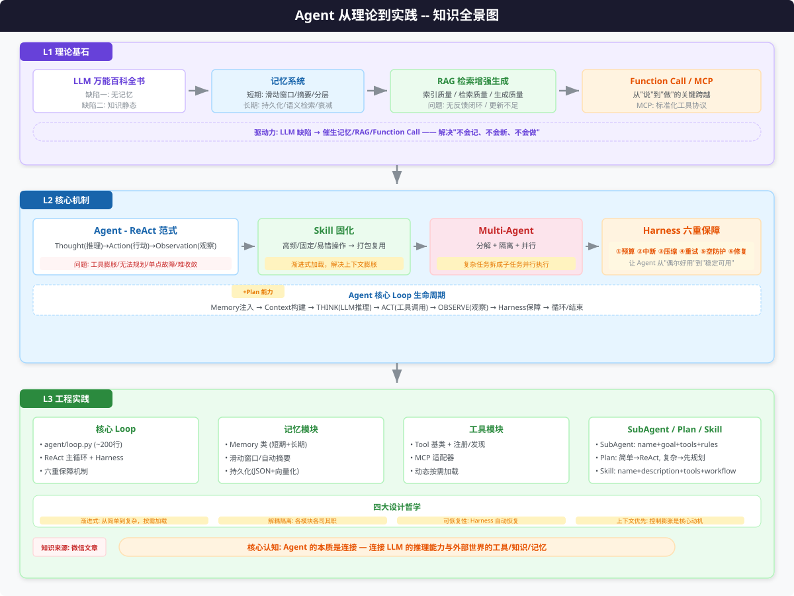
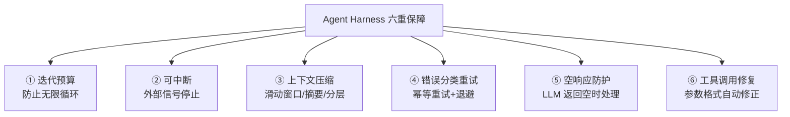
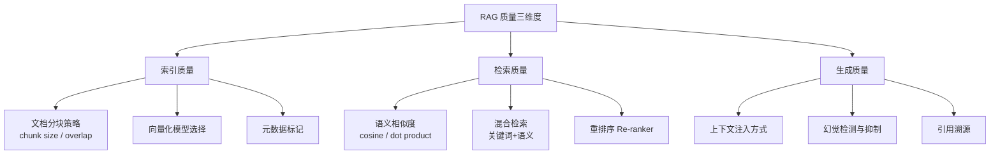
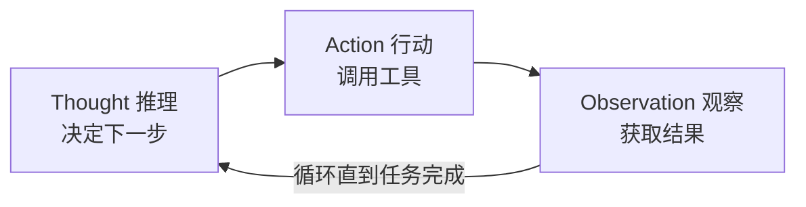
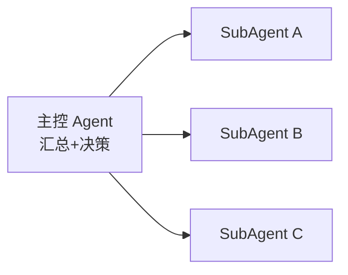
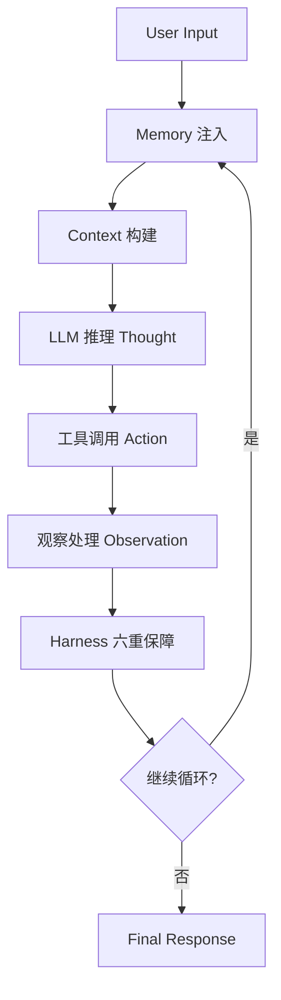
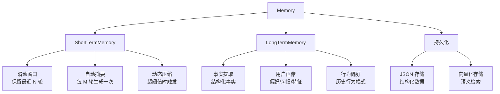
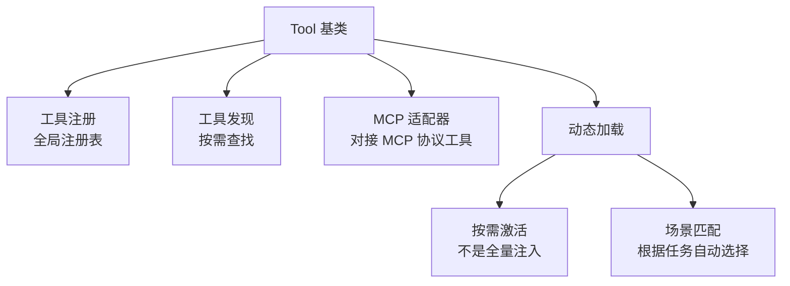
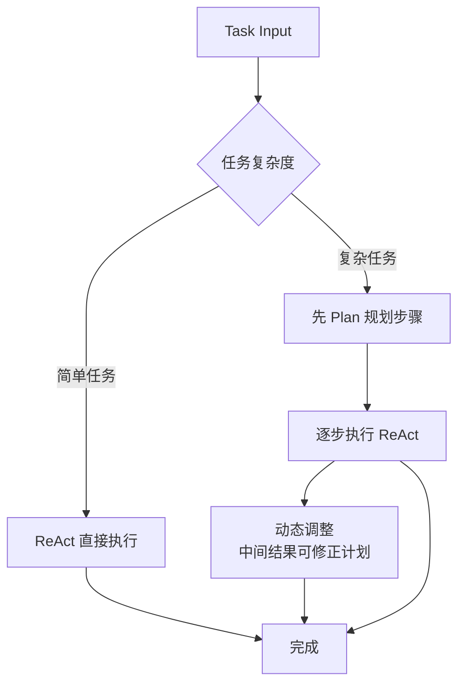
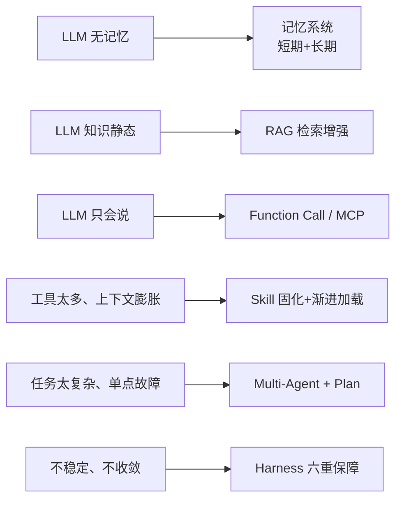

# Agent 从理论到实践 — 读书笔记

> **来源**：微信公众号文章（约 97K 字）
> **笔记类型**：知识结构化 + 全景图 + 实践拆解
> **笔记日期**：2026-06-02

---

# 一、知识全景图



## 1.2 三层能力栈脉络

## 1.3 六重保障体系（Harness）



---

# 二、理论篇核心笔记

## 第 01 章 · 大模型的出现

### 核心观点
- LLM 是**万能百科全书**——知识广博但有两个致命缺陷
- **缺陷一：无记忆**。每次对话独立，无法跨 session 保留状态和上下文
- **缺陷二：知识静态**。训练截止后知识固化，无法自动追踪新信息

### 关键洞察
这两个缺陷是后续所有技术演进的**根本驱动力**：
- 无记忆 → 催生**记忆系统**（第 02 章）
- 知识静态 → 催生**RAG**（第 03 章）

---

## 第 02 章 · 记忆系统

### 短期记忆（对话上下文）

| 方案 | 原理 | 优势 | 劣势 |
|------|------|------|------|
| 滑动窗口 | 保留最近 N 轮对话 | 实现简单 | 丢失早期关键信息 |
| 摘要 | 定时压缩历史为摘要 | 信息密度高 | 细节丢失 |
| 分层 | 窗口+摘要混合 | 兼顾近远 | 实现复杂 |
| 结构化 | 按角色/意图归类 | 检索友好 | 需要额外分类 |
| 虚拟分页 | 分页式上下文管理 | 突破长度限制 | 切换开销 |

### 长期记忆（持久化知识）

- **持久化存储**：JSON / 向量数据库
- **语义检索**：基于 embedding 的相似度搜索
- **衰减机制**：时间越久，权重越低，自动遗忘

### 主流方案对比
> 文章对主流记忆方案进行了详细对比（待补充具体方案名称和指标）

---

## 第 03 章 · RAG（检索增强生成）

### 三大质量维度



### 当前三大问题
1. **缺少链路反馈闭环**：检索→生成之间没有质量反馈回路
2. **知识更新触发不足**：依赖手动/定期索引，缺乏自动更新机制
3. **幻觉未能根本上抑制**：RAG 降低幻觉概率但无法消除

---

## 第 04 章 · Function Call & MCP

### 核心突破：从"说"到"做"
- **Function Calling**：LLM 不仅能生成文本，还能调用外部工具/API
- 模型输出结构化的工具调用参数 → 系统执行 → 返回结果给模型

### MCP（Model Context Protocol）
- **标准化工具协议**：统一工具定义、发现、调用接口
- 类比 HTTP 之于 Web——MCP 是 Agent 工具生态的"HTTP"
- 让不同模型的工具调用方式一致化

---

## 第 05 章 · Agent 的出现

### ReAct 范式



- **Thought**：模型推理当前状态，决定下一步做什么
- **Action**：调用某个工具或执行某个操作
- **Observation**：获取工具返回结果，更新状态

### 当前四大问题
1. **工具数量膨胀**：上下文装不下所有工具定义
2. **无法规划复杂任务**：纯 ReAct 在长链任务中容易迷失
3. **单点故障**：一个工具出错导致整个链路失败
4. **难以收敛**：循环次数不可控，容易陷入死循环

> 这四个问题分别催生了：Skill（第 06 章）、Plan 能力、Multi-Agent（第 07 章）、Harness（第 08 章）

---

## 第 06 章 · Skill 的出现

### 核心思路
- **固化高频操作**：将频繁、固定、易错的操作序列打包为 Skill
- Skill **不是 Tool**——Tool 是原子操作，Skill 是操作序列/工作流

### 关键设计
- **渐进式加载**：不一次性加载所有 Skill，而是按需激活
- **解决的核心问题**：上下文膨胀和失焦——Skill 减少 token 占用，让模型聚焦当前任务

---

## 第 07 章 · Multi-Agent

### 三大设计原则
1. **分解**：将复杂任务拆解为子任务
2. **隔离**：每个 SubAgent 独立运行，互不干扰
3. **并行**：子任务可同时执行，提升效率

### 工作模式


---

## 第 08 章 · Harness

### 六重保障体系（核心）

| # | 保障机制 | 说明 |
|---|---------|------|
| ① | **迭代预算** | 限制最大循环轮次，防止死循环 |
| ② | **可中断** | 支持外部信号停止 Agent 运行 |
| ③ | **上下文压缩** | 自动压缩历史，控制上下文长度 |
| ④ | **错误分类+重试** | 区分可重试/不可重试错误，幂等重试+退避 |
| ⑤ | **空响应防护** | LLM 返回空/无效响应时的兜底策略 |
| ⑥ | **工具调用修复** | 自动修正工具调用参数的格式错误 |

### 核心理念
> 让 Agent 从"偶尔好用"变成"稳定可用"——异常自动恢复，无需人工介入

---

# 三、实践篇核心笔记

## 第 01 章 · 项目总览

### 云端通用 Agent 架构
- 目标是构建一个**通用的云端 Agent 系统**，可扩展、可运维
- 架构分层清晰：核心 Loop → 记忆 → 工具 → SubAgent → Skill → Harness

---

## 第 02 章 · 核心 Loop 设计

### ReAct 主循环
- 代码位置：`agent/loop.py`（约 200 行）
- 核心数据流：



### 六重保障实现要点
- 每次迭代检查预算计数器
- 上下文超过阈值触发压缩（滑动窗口 or 摘要）
- 工具调用异常时自动分类 + 重试最多 3 次
- 空响应触发 fallback 策略

---

## 第 03 章 · 记忆模块

### Memory 类结构



### 记忆注入格式
```xml
<memory-context>
[短期记忆摘要]
[长期记忆事实]
[用户画像]
</memory-context>
```

---

## 第 04 章 · 工具模块

### 架构设计



### 关键设计决策
- **不一次性注入所有工具** → 按场景动态加载，控制上下文长度
- **MCP 适配器** → 兼容标准 MCP 协议的工具生态

---

## 第 05 章 · SubAgent 设计

### SubAgent 定义结构

```python
SubAgent = {
    "name": "子 Agent 名称",
    "goal": "子目标描述",
    "tools": ["工具1", "工具2", ...],
    "delegate_rules": "什么情况下委托给此 SubAgent"
}
```

### 执行流程
1. 主控 Agent 分析任务，决定是否需要分解
2. 匹配 delegate_rules，选择合适的 SubAgent
3. 子任务隔离执行（独立的上下文+工具集）
4. 并行执行非依赖子任务
5. 主控汇总各 SubAgent 结果

---

## 第 06 章 · ReAct 下的 Plan 能力

### 动态切换策略



- **简单任务**：直接走 ReAct 循环，效率最高
- **复杂任务**：先规划（Plan），再执行（ReAct），动态调整

---

## 第 07 章 · Skill 设计

### Skill 模板结构

```yaml
Skill:
  name: "技能名称"
  description: "技能描述"
  tools: ["所需工具列表"]
  workflow: "执行流程/步骤"
```

### 渐进式加载机制
- 不预加载所有 Skill
- 根据当前任务上下文，按需激活相关 Skill
- Skill 之间可组合、可嵌套

### 内置 Skill 示例

| Skill 名称 | 用途 | 核心工具 |
|-----------|------|---------|
| 日志排查 | 定位日志中的异常 | grep、时间过滤、日志分析 |
| 代码审查 | 自动审查代码质量 | lint、diff、静态分析 |
| 架构分析 | 分析系统架构 | 依赖分析、模块关系图 |

---

# 四、核心设计原则总结

## 4.1 从问题到方案的演进脉络



## 4.2 架构设计哲学

1. **渐进式**：从简单到复杂，按需加载，动态切换
2. **解耦与隔离**：记忆/工具/Agent/Skill 各司其职，SubAgent 独立运行
3. **可恢复性**：Harness 是核心——让 Agent 从各种异常中自动恢复
4. **上下文管理优先**：所有设计的核心动机都是"控制上下文膨胀"

---

# 五、关键代码与实现索引

| 模块 | 文件/位置 | 核心内容 | 代码量 |
|------|----------|---------|--------|
| 核心 Loop | `agent/loop.py` | ReAct 主循环 + Harness | ~200 行 |
| 记忆模块 | Memory 类 | 短期+长期，滑动窗口+摘要+向量化 | — |
| 工具模块 | Tool 基类 | 注册、发现、MCP 适配、动态加载 | — |
| SubAgent | SubAgent 定义 | 任务分解、隔离执行、结果汇总 | — |
| Skill 系统 | Skill 模板 | 渐进式加载、内置场景 Skill | — |

---

# 六、个人思考与延伸

1. **Agent 的本质是"连接"**：连接 LLM 的推理能力与外部世界的工具/知识/记忆
2. **RAG 不是银弹**：幻觉问题需要记忆+工具+校验多管齐下
3. **Harness 是 Agent 落地的关键**：从 Demo 到产品的核心差距在于稳定性和异常处理
4. **Skill 是 Agent 的"肌肉记忆"**：让高频操作自动化，模型只需做关键决策
5. **Multi-Agent 的适用边界**：不是所有任务都需要多 Agent——分解也有成本

---

*读书笔记完*
