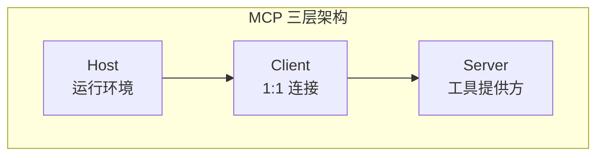

# Agent 从理论到实践 — 知识全景与深度笔记

> 本文基于一篇约 97K 字的超级长文整理而成，从 LLM 的固有缺陷出发，逐步搭起完整的 Agent 系统：记忆 → RAG → Function Call / MCP → ReAct → Skill → Multi-Agent → Harness，再到实践篇的完整代码实现。

![Agent 从理论到实践知识体系](data:image/svg+xml;base64,PD94bWwgdmVyc2lvbj0iMS4wIiBlbmNvZGluZz0iVVRGLTgiPz4KPHN2ZyB4bWxucz0iaHR0cDovL3d3dy53My5vcmcvMjAwMC9zdmciIHZpZXdCb3g9IjAgMCAxMjAwIDkwMCIgd2lkdGg9IjEyMDAiIGhlaWdodD0iOTAwIiBmb250LWZhbWlseT0ic2Fucy1zZXJpZiI+CiAgPGRlZnM+CiAgICA8ZmlsdGVyIGlkPSJzaGFkb3ciIHg9Ii0zJSIgeT0iLTMlIiB3aWR0aD0iMTA2JSIgaGVpZ2h0PSIxMDYlIj4KICAgICAgPGZlRHJvcFNoYWRvdyBkeD0iMSIgZHk9IjIiIHN0ZERldmlhdGlvbj0iMyIgZmxvb2Qtb3BhY2l0eT0iMC4xMiIvPgogICAgPC9maWx0ZXI+CiAgICA8bWFya2VyIGlkPSJhcnJvdyIgbWFya2VyV2lkdGg9IjgiIG1hcmtlckhlaWdodD0iNiIgcmVmWD0iOCIgcmVmWT0iMyIgb3JpZW50PSJhdXRvIj4KICAgICAgPHBvbHlnb24gcG9pbnRzPSIwIDAsIDggMywgMCA2IiBmaWxsPSIjODY4ZTk2Ii8+CiAgICA8L21hcmtlcj4KICA8L2RlZnM+CgogIDxyZWN0IHdpZHRoPSIxMjAwIiBoZWlnaHQ9IjkwMCIgZmlsbD0iI2Y4ZjlmYSIgcng9IjgiLz4KCiAgPHJlY3QgeD0iMCIgeT0iMCIgd2lkdGg9IjEyMDAiIGhlaWdodD0iNDgiIGZpbGw9IiMxYTFhMmUiIHJ4PSI4Ii8+CiAgPHJlY3QgeD0iMCIgeT0iMjQiIHdpZHRoPSIxMjAwIiBoZWlnaHQ9IjI0IiBmaWxsPSIjMWExYTJlIi8+CiAgPHRleHQgeD0iNjAwIiB5PSIzMCIgdGV4dC1hbmNob3I9Im1pZGRsZSIgZmlsbD0iI2ZmZiIgZm9udC1zaXplPSIyMCIgZm9udC13ZWlnaHQ9ImJvbGQiPkFnZW50IOS7jueQhuiuuuWIsOWunui3tSAtLSDnn6Xor4blhajmma/lm748L3RleHQ+CgogIDwhLS0gPT09PT09PT09PT09PT09PT09PT09PT09PT09PT09PT09PT09PT09PT09PT0gLS0+CiAgPCEtLSBMMTog55CG6K665Z+655+zIC0tPgogIDwhLS0gPT09PT09PT09PT09PT09PT09PT09PT09PT09PT09PT09PT09PT09PT09PT0gLS0+CiAgPHJlY3QgeD0iMzAiIHk9IjY0IiB3aWR0aD0iMTE0MCIgaGVpZ2h0PSIxODUiIHJ4PSIxMCIgZmlsbD0iI2YzZjBmZiIgc3Ryb2tlPSIjZDBiZmZmIiBzdHJva2Utd2lkdGg9IjEuNSIgZmlsdGVyPSJ1cmwoI3NoYWRvdykiLz4KCiAgPHJlY3QgeD0iMzAiIHk9IjY0IiB3aWR0aD0iMTQwIiBoZWlnaHQ9IjI4IiByeD0iNiIgZmlsbD0iIzY3NDFkOSIvPgogIDx0ZXh0IHg9IjEwMCIgeT0iODMiIHRleHQtYW5jaG9yPSJtaWRkbGUiIGZpbGw9IiNmZmYiIGZvbnQtc2l6ZT0iMTMiIGZvbnQtd2VpZ2h0PSJib2xkIj5MMSDnkIborrrln7rnn7M8L3RleHQ+CgogIDwhLS0gTExNIC0tPgogIDxyZWN0IHg9IjUwIiB5PSIxMDUiIHdpZHRoPSIyMzAiIGhlaWdodD0iNjUiIHJ4PSI2IiBmaWxsPSIjZmZmIiBzdHJva2U9IiNkMGJmZmYiIHN0cm9rZS13aWR0aD0iMS41Ii8+CiAgPHRleHQgeD0iMTY1IiB5PSIxMjciIHRleHQtYW5jaG9yPSJtaWRkbGUiIGZpbGw9IiM2NzQxZDkiIGZvbnQtc2l6ZT0iMTMiIGZvbnQtd2VpZ2h0PSJib2xkIj5MTE0g5LiH6IO955m+56eR5YWo5LmmPC90ZXh0PgogIDx0ZXh0IHg9IjE2NSIgeT0iMTQ3IiB0ZXh0LWFuY2hvcj0ibWlkZGxlIiBmaWxsPSIjODY4ZTk2IiBmb250LXNpemU9IjExIj7nvLrpmbfkuIA6IOaXoOiusOW/hjwvdGV4dD4KICA8dGV4dCB4PSIxNjUiIHk9IjE2MyIgdGV4dC1hbmNob3I9Im1pZGRsZSIgZmlsbD0iIzg2OGU5NiIgZm9udC1zaXplPSIxMSI+57y66Zm35LqMOiDnn6Xor4bpnZnmgIE8L3RleHQ+CgogIDxsaW5lIHgxPSIyODUiIHkxPSIxMzciIHgyPSIzMTUiIHkyPSIxMzciIHN0cm9rZT0iIzg2OGU5NiIgc3Ryb2tlLXdpZHRoPSIyLjUiIG1hcmtlci1lbmQ9InVybCgjYXJyb3cpIi8+CgogIDwhLS0g6K6w5b+GIC0tPgogIDxyZWN0IHg9IjMyMCIgeT0iMTA1IiB3aWR0aD0iMjMwIiBoZWlnaHQ9IjY1IiByeD0iNiIgZmlsbD0iI2U3ZjVmZiIgc3Ryb2tlPSIjYTVkOGZmIiBzdHJva2Utd2lkdGg9IjEuNSIvPgogIDx0ZXh0IHg9IjQzNSIgeT0iMTI3IiB0ZXh0LWFuY2hvcj0ibWlkZGxlIiBmaWxsPSIjMTg2NGFiIiBmb250LXNpemU9IjEzIiBmb250LXdlaWdodD0iYm9sZCI+6K6w5b+G57O757ufPC90ZXh0PgogIDx0ZXh0IHg9IjQzNSIgeT0iMTQ3IiB0ZXh0LWFuY2hvcj0ibWlkZGxlIiBmaWxsPSIjNDk1MDU3IiBmb250LXNpemU9IjExIj7nn63mnJ86IOa7keWKqOeql+WPoy/mkZjopoEv5YiG5bGCPC90ZXh0PgogIDx0ZXh0IHg9IjQzNSIgeT0iMTYzIiB0ZXh0LWFuY2hvcj0ibWlkZGxlIiBmaWxsPSIjODY4ZTk2IiBmb250LXNpemU9IjExIj7plb/mnJ86IOaMgeS5heWMli/or63kuYnmo4DntKIv6KGw5YePPC90ZXh0PgoKICA8bGluZSB4MT0iNTU1IiB5MT0iMTM3IiB4Mj0iNTg1IiB5Mj0iMTM3IiBzdHJva2U9IiM4NjhlOTYiIHN0cm9rZS13aWR0aD0iMi41IiBtYXJrZXItZW5kPSJ1cmwoI2Fycm93KSIvPgoKICA8IS0tIFJBRyAtLT4KICA8cmVjdCB4PSI1OTAiIHk9IjEwNSIgd2lkdGg9IjI1MCIgaGVpZ2h0PSI2NSIgcng9IjYiIGZpbGw9IiNlYmZiZWUiIHN0cm9rZT0iI2IyZjJiYiIgc3Ryb2tlLXdpZHRoPSIxLjUiLz4KICA8dGV4dCB4PSI3MTUiIHk9IjEyNyIgdGV4dC1hbmNob3I9Im1pZGRsZSIgZmlsbD0iIzJiOGEzZSIgZm9udC1zaXplPSIxMyIgZm9udC13ZWlnaHQ9ImJvbGQiPlJBRyDmo4DntKLlop7lvLrnlJ/miJA8L3RleHQ+CiAgPHRleHQgeD0iNzE1IiB5PSIxNDciIHRleHQtYW5jaG9yPSJtaWRkbGUiIGZpbGw9IiM0OTUwNTciIGZvbnQtc2l6ZT0iMTEiPue0ouW8lei0qOmHjyAvIOajgOe0oui0qOmHjyAvIOeUn+aIkOi0qOmHjzwvdGV4dD4KICA8dGV4dCB4PSI3MTUiIHk9IjE2MyIgdGV4dC1hbmNob3I9Im1pZGRsZSIgZmlsbD0iIzg2OGU5NiIgZm9udC1zaXplPSIxMSI+6Zeu6aKYOiDml6Dlj43ppojpl63njq8gLyDmm7TmlrDkuI3otrM8L3RleHQ+CgogIDxsaW5lIHgxPSI4NDUiIHkxPSIxMzciIHgyPSI4NzUiIHkyPSIxMzciIHN0cm9rZT0iIzg2OGU5NiIgc3Ryb2tlLXdpZHRoPSIyLjUiIG1hcmtlci1lbmQ9InVybCgjYXJyb3cpIi8+CgogIDwhLS0gRnVuY3Rpb24gQ2FsbCAtLT4KICA8cmVjdCB4PSI4ODAiIHk9IjEwNSIgd2lkdGg9IjI3MCIgaGVpZ2h0PSI2NSIgcng9IjYiIGZpbGw9IiNmZmYzZTAiIHN0cm9rZT0iI2ZmZTBiMiIgc3Ryb2tlLXdpZHRoPSIxLjUiLz4KICA8dGV4dCB4PSIxMDE1IiB5PSIxMjciIHRleHQtYW5jaG9yPSJtaWRkbGUiIGZpbGw9IiNlNjUxMDAiIGZvbnQtc2l6ZT0iMTMiIGZvbnQtd2VpZ2h0PSJib2xkIj5GdW5jdGlvbiBDYWxsIC8gTUNQPC90ZXh0PgogIDx0ZXh0IHg9IjEwMTUiIHk9IjE0NyIgdGV4dC1hbmNob3I9Im1pZGRsZSIgZmlsbD0iIzQ5NTA1NyIgZm9udC1zaXplPSIxMSI+5LuOIuivtCLliLAi5YGaIueahOWFs+mUrui3qOi2ijwvdGV4dD4KICA8dGV4dCB4PSIxMDE1IiB5PSIxNjMiIHRleHQtYW5jaG9yPSJtaWRkbGUiIGZpbGw9IiM4NjhlOTYiIGZvbnQtc2l6ZT0iMTEiPk1DUDog5qCH5YeG5YyW5bel5YW35Y2P6K6uPC90ZXh0PgoKICA8IS0tIOmpseWKqOWKm+agh+azqCAtLT4KICA8cmVjdCB4PSI1MCIgeT0iMTg1IiB3aWR0aD0iMTEwMCIgaGVpZ2h0PSIyOCIgcng9IjE0IiBmaWxsPSIjZjNmMGZmIiBzdHJva2U9IiNkMGJmZmYiIHN0cm9rZS13aWR0aD0iMSIgc3Ryb2tlLWRhc2hhcnJheT0iNCwyIi8+CiAgPHRleHQgeD0iNjAwIiB5PSIyMDQiIHRleHQtYW5jaG9yPSJtaWRkbGUiIGZpbGw9IiM2NzQxZDkiIGZvbnQtc2l6ZT0iMTEiIGZvbnQtd2VpZ2h0PSJib2xkIj7pqbHliqjlips6IExMTSDnvLrpmbcg4oaSIOWCrOeUn+iusOW/hi9SQUcvRnVuY3Rpb24gQ2FsbCDigJTigJQg6Kej5YazIuS4jeS8muiusOOAgeS4jeS8muaWsOOAgeS4jeS8muWBmiI8L3RleHQ+CgogIDxsaW5lIHgxPSI2MDAiIHkxPSIyNDkiIHgyPSI2MDAiIHkyPSIyNzgiIHN0cm9rZT0iIzg2OGU5NiIgc3Ryb2tlLXdpZHRoPSIyLjUiIG1hcmtlci1lbmQ9InVybCgjYXJyb3cpIi8+CgogIDwhLS0gPT09PT09PT09PT09PT09PT09PT09PT09PT09PT09PT09PT09PT09PT09PT0gLS0+CiAgPCEtLSBMMjog5qC45b+D5py65Yi2IC0tPgogIDwhLS0gPT09PT09PT09PT09PT09PT09PT09PT09PT09PT09PT09PT09PT09PT09PT0gLS0+CiAgPHJlY3QgeD0iMzAiIHk9IjI4OCIgd2lkdGg9IjExNDAiIGhlaWdodD0iMjYwIiByeD0iMTAiIGZpbGw9IiNlN2Y1ZmYiIHN0cm9rZT0iI2E1ZDhmZiIgc3Ryb2tlLXdpZHRoPSIxLjUiIGZpbHRlcj0idXJsKCNzaGFkb3cpIi8+CgogIDxyZWN0IHg9IjMwIiB5PSIyODgiIHdpZHRoPSIxNDAiIGhlaWdodD0iMjgiIHJ4PSI2IiBmaWxsPSIjMTg2NGFiIi8+CiAgPHRleHQgeD0iMTAwIiB5PSIzMDciIHRleHQtYW5jaG9yPSJtaWRkbGUiIGZpbGw9IiNmZmYiIGZvbnQtc2l6ZT0iMTMiIGZvbnQtd2VpZ2h0PSJib2xkIj5MMiDmoLjlv4PmnLrliLY8L3RleHQ+CgogIDwhLS0gQWdlbnQgUmVBY3QgLS0+CiAgPHJlY3QgeD0iNTAiIHk9IjMzMCIgd2lkdGg9IjMxMCIgaGVpZ2h0PSI4NSIgcng9IjYiIGZpbGw9IiNmZmYiIHN0cm9rZT0iI2E1ZDhmZiIgc3Ryb2tlLXdpZHRoPSIxLjUiLz4KICA8dGV4dCB4PSIyMDUiIHk9IjM1MyIgdGV4dC1hbmNob3I9Im1pZGRsZSIgZmlsbD0iIzE4NjRhYiIgZm9udC1zaXplPSIxNCIgZm9udC13ZWlnaHQ9ImJvbGQiPkFnZW50IC0gUmVBY3Qg6IyD5byPPC90ZXh0PgogIDx0ZXh0IHg9IjIwNSIgeT0iMzc1IiB0ZXh0LWFuY2hvcj0ibWlkZGxlIiBmaWxsPSIjNDk1MDU3IiBmb250LXNpemU9IjExIj5UaG91Z2h0KOaOqOeQhinihpJBY3Rpb24o6KGM5YqoKeKGkk9ic2VydmF0aW9uKOinguWvnyk8L3RleHQ+CiAgPHJlY3QgeD0iNjAiIHk9IjM4OCIgd2lkdGg9IjI5MCIgaGVpZ2h0PSIyMCIgcng9IjQiIGZpbGw9IiNmZmY1ZjUiLz4KICA8dGV4dCB4PSIyMDUiIHk9IjQwMyIgdGV4dC1hbmNob3I9Im1pZGRsZSIgZmlsbD0iI2M5MmEyYSIgZm9udC1zaXplPSIxMCI+6Zeu6aKYOiDlt6Xlhbfohqjog4Av5peg5rOV6KeE5YiSL+WNleeCueaVhemanC/pmr7mlLbmlZs8L3RleHQ+CgogIDwhLS0gU2tpbGwgLS0+CiAgPHJlY3QgeD0iMzkwIiB5PSIzMzAiIHdpZHRoPSIyMzAiIGhlaWdodD0iODUiIHJ4PSI2IiBmaWxsPSIjZWJmYmVlIiBzdHJva2U9IiNiMmYyYmIiIHN0cm9rZS13aWR0aD0iMS41Ii8+CiAgPHRleHQgeD0iNTA1IiB5PSIzNTMiIHRleHQtYW5jaG9yPSJtaWRkbGUiIGZpbGw9IiMyYjhhM2UiIGZvbnQtc2l6ZT0iMTQiIGZvbnQtd2VpZ2h0PSJib2xkIj5Ta2lsbCDlm7rljJY8L3RleHQ+CiAgPHRleHQgeD0iNTA1IiB5PSIzNzUiIHRleHQtYW5jaG9yPSJtaWRkbGUiIGZpbGw9IiM0OTUwNTciIGZvbnQtc2l6ZT0iMTEiPumrmOmikS/lm7rlrpov5piT6ZSZ5pON5L2cIOKGkiDmiZPljIXlpI3nlKg8L3RleHQ+CiAgPHJlY3QgeD0iNDAwIiB5PSIzODgiIHdpZHRoPSIyMTAiIGhlaWdodD0iMjAiIHJ4PSI0IiBmaWxsPSIjZmZmM2JmIi8+CiAgPHRleHQgeD0iNTA1IiB5PSI0MDMiIHRleHQtYW5jaG9yPSJtaWRkbGUiIGZpbGw9IiNlNjc3MDAiIGZvbnQtc2l6ZT0iMTAiPua4kOi/m+W8j+WKoOi9ve+8jOino+WGs+S4iuS4i+aWh+iGqOiDgDwvdGV4dD4KCiAgPGxpbmUgeDE9IjM2NSIgeTE9IjM3MiIgeDI9IjM4NSIgeTI9IjM3MiIgc3Ryb2tlPSIjODY4ZTk2IiBzdHJva2Utd2lkdGg9IjIiIG1hcmtlci1lbmQ9InVybCgjYXJyb3cpIi8+CgogIDwhLS0gTXVsdGktQWdlbnQgLS0+CiAgPHJlY3QgeD0iNjUwIiB5PSIzMzAiIHdpZHRoPSIyMzAiIGhlaWdodD0iODUiIHJ4PSI2IiBmaWxsPSIjZmNlNGVjIiBzdHJva2U9IiNmZmNkZDIiIHN0cm9rZS13aWR0aD0iMS41Ii8+CiAgPHRleHQgeD0iNzY1IiB5PSIzNTMiIHRleHQtYW5jaG9yPSJtaWRkbGUiIGZpbGw9IiNjNjI4MjgiIGZvbnQtc2l6ZT0iMTQiIGZvbnQtd2VpZ2h0PSJib2xkIj5NdWx0aS1BZ2VudDwvdGV4dD4KICA8dGV4dCB4PSI3NjUiIHk9IjM3NSIgdGV4dC1hbmNob3I9Im1pZGRsZSIgZmlsbD0iIzQ5NTA1NyIgZm9udC1zaXplPSIxMSI+5YiG6KejICsg6ZqU56a7ICsg5bm26KGMPC90ZXh0PgogIDxyZWN0IHg9IjY2MCIgeT0iMzg4IiB3aWR0aD0iMjEwIiBoZWlnaHQ9IjIwIiByeD0iNCIgZmlsbD0iI2ZmZjNiZiIvPgogIDx0ZXh0IHg9Ijc2NSIgeT0iNDAzIiB0ZXh0LWFuY2hvcj0ibWlkZGxlIiBmaWxsPSIjZTY3NzAwIiBmb250LXNpemU9IjEwIj7lpI3mnYLku7vliqHmi4bmiJDlrZDku7vliqHlubbooYzmiafooYw8L3RleHQ+CgogIDxsaW5lIHgxPSI2MjUiIHkxPSIzNzIiIHgyPSI2NDUiIHkyPSIzNzIiIHN0cm9rZT0iIzg2OGU5NiIgc3Ryb2tlLXdpZHRoPSIyIiBtYXJrZXItZW5kPSJ1cmwoI2Fycm93KSIvPgoKICA8IS0tIEhhcm5lc3MgLS0+CiAgPHJlY3QgeD0iOTEwIiB5PSIzMzAiIHdpZHRoPSIyNDAiIGhlaWdodD0iODUiIHJ4PSI2IiBmaWxsPSIjZmZmM2UwIiBzdHJva2U9IiNmZmUwYjIiIHN0cm9rZS13aWR0aD0iMS41Ii8+CiAgPHRleHQgeD0iMTAzMCIgeT0iMzUzIiB0ZXh0LWFuY2hvcj0ibWlkZGxlIiBmaWxsPSIjZTY1MTAwIiBmb250LXNpemU9IjE0IiBmb250LXdlaWdodD0iYm9sZCI+SGFybmVzcyDlha3ph43kv53pmpw8L3RleHQ+CiAgPHJlY3QgeD0iOTIwIiB5PSIzNjUiIHdpZHRoPSIyMjAiIGhlaWdodD0iNDMiIHJ4PSI0IiBmaWxsPSIjZmZmOGUxIi8+CiAgPHRleHQgeD0iMTAzMCIgeT0iMzgzIiB0ZXh0LWFuY2hvcj0ibWlkZGxlIiBmaWxsPSIjZTY1MTAwIiBmb250LXNpemU9IjEwIiBmb250LXdlaWdodD0iYm9sZCI+4pGg6aKE566XIOKRoeS4reaWrSDikaLljovnvKkg4pGj6YeN6K+VIOKRpOepuumYsuaKpCDikaXkv67lpI08L3RleHQ+CiAgPHRleHQgeD0iMTAzMCIgeT0iNDAxIiB0ZXh0LWFuY2hvcj0ibWlkZGxlIiBmaWxsPSIjODY4ZTk2IiBmb250LXNpemU9IjEwIj7orqkgQWdlbnQg5LuOIuWBtuWwlOWlveeUqCLliLAi56iz5a6a5Y+v55SoIjwvdGV4dD4KCiAgPGxpbmUgeDE9Ijg4NSIgeTE9IjM3MiIgeDI9IjkwNSIgeTI9IjM3MiIgc3Ryb2tlPSIjODY4ZTk2IiBzdHJva2Utd2lkdGg9IjIiIG1hcmtlci1lbmQ9InVybCgjYXJyb3cpIi8+CgogIDwhLS0gQXJjaGl0ZWN0dXJlIGJvdHRvbSBiYXIgLS0+CiAgPHJlY3QgeD0iNTAiIHk9IjQzMCIgd2lkdGg9IjExMDAiIGhlaWdodD0iNDYiIHJ4PSI2IiBmaWxsPSIjZmZmIiBzdHJva2U9IiNhNWQ4ZmYiIHN0cm9rZS13aWR0aD0iMSIgc3Ryb2tlLWRhc2hhcnJheT0iNCwyIi8+CiAgPHRleHQgeD0iNjAwIiB5PSI0NTAiIHRleHQtYW5jaG9yPSJtaWRkbGUiIGZpbGw9IiMxODY0YWIiIGZvbnQtc2l6ZT0iMTIiIGZvbnQtd2VpZ2h0PSJib2xkIj5BZ2VudCDmoLjlv4MgTG9vcCDnlJ/lkb3lkajmnJ88L3RleHQ+CiAgPHRleHQgeD0iNjAwIiB5PSI0NjgiIHRleHQtYW5jaG9yPSJtaWRkbGUiIGZpbGw9IiM0OTUwNTciIGZvbnQtc2l6ZT0iMTEiPk1lbW9yeeazqOWFpSDihpIgQ29udGV4dOaehOW7uiDihpIgVEhJTksoTExN5o6o55CGKSDihpIgQUNUKOW3peWFt+iwg+eUqCkg4oaSIE9CU0VSVkUo6KeC5a+fKSDihpIgSGFybmVzc+S/nemanCDihpIg5b6q546vL+e7k+adnzwvdGV4dD4KCiAgPCEtLSBBcnJvdzogaG93IFJlQWN0IGZlZWRzIGludG8gUGxhbiAtLT4KICA8cmVjdCB4PSIzNTAiIHk9IjQzMCIgd2lkdGg9IjgwIiBoZWlnaHQ9IjIwIiByeD0iNCIgZmlsbD0iI2ZmZjNiZiIvPgogIDx0ZXh0IHg9IjM5MCIgeT0iNDQ0IiB0ZXh0LWFuY2hvcj0ibWlkZGxlIiBmaWxsPSIjZTY3NzAwIiBmb250LXNpemU9IjkiIGZvbnQtd2VpZ2h0PSJib2xkIj4rUGxhbiDog73lips8L3RleHQ+CgogIDxsaW5lIHgxPSI2MDAiIHkxPSI1NDgiIHgyPSI2MDAiIHkyPSI1NzgiIHN0cm9rZT0iIzg2OGU5NiIgc3Ryb2tlLXdpZHRoPSIyLjUiIG1hcmtlci1lbmQ9InVybCgjYXJyb3cpIi8+CgogIDwhLS0gPT09PT09PT09PT09PT09PT09PT09PT09PT09PT09PT09PT09PT09PT09PT0gLS0+CiAgPCEtLSBMMzog5bel56iL5a6e6Le1IC0tPgogIDwhLS0gPT09PT09PT09PT09PT09PT09PT09PT09PT09PT09PT09PT09PT09PT09PT0gLS0+CiAgPHJlY3QgeD0iMzAiIHk9IjU4OCIgd2lkdGg9IjExNDAiIGhlaWdodD0iMjg1IiByeD0iMTAiIGZpbGw9IiNlYmZiZWUiIHN0cm9rZT0iI2IyZjJiYiIgc3Ryb2tlLXdpZHRoPSIxLjUiIGZpbHRlcj0idXJsKCNzaGFkb3cpIi8+CgogIDxyZWN0IHg9IjMwIiB5PSI1ODgiIHdpZHRoPSIxNDAiIGhlaWdodD0iMjgiIHJ4PSI2IiBmaWxsPSIjMmI4YTNlIi8+CiAgPHRleHQgeD0iMTAwIiB5PSI2MDciIHRleHQtYW5jaG9yPSJtaWRkbGUiIGZpbGw9IiNmZmYiIGZvbnQtc2l6ZT0iMTMiIGZvbnQtd2VpZ2h0PSJib2xkIj5MMyDlt6XnqIvlrp7ot7U8L3RleHQ+CgogIDwhLS0gQ29yZSBMb29wIC0tPgogIDxyZWN0IHg9IjUwIiB5PSI2MzAiIHdpZHRoPSIyNTAiIGhlaWdodD0iMTAwIiByeD0iNiIgZmlsbD0iI2ZmZiIgc3Ryb2tlPSIjYjJmMmJiIiBzdHJva2Utd2lkdGg9IjEuNSIvPgogIDx0ZXh0IHg9IjE3NSIgeT0iNjUzIiB0ZXh0LWFuY2hvcj0ibWlkZGxlIiBmaWxsPSIjMmI4YTNlIiBmb250LXNpemU9IjEzIiBmb250LXdlaWdodD0iYm9sZCI+5qC45b+DIExvb3A8L3RleHQ+CiAgPHRleHQgeD0iNjAiIHk9IjY3NSIgZmlsbD0iIzQ5NTA1NyIgZm9udC1zaXplPSIxMSI+4oCiIGFnZW50L2xvb3AucHkgKH4yMDDooYwpPC90ZXh0PgogIDx0ZXh0IHg9IjYwIiB5PSI2OTUiIGZpbGw9IiM0OTUwNTciIGZvbnQtc2l6ZT0iMTEiPuKAoiBSZUFjdCDkuLvlvqrnjq8gKyBIYXJuZXNzPC90ZXh0PgogIDx0ZXh0IHg9IjYwIiB5PSI3MTUiIGZpbGw9IiM0OTUwNTciIGZvbnQtc2l6ZT0iMTEiPuKAoiDlha3ph43kv53pmpzmnLrliLY8L3RleHQ+CgogIDwhLS0gTWVtb3J5IE1vZHVsZSAtLT4KICA8cmVjdCB4PSIzMzAiIHk9IjYzMCIgd2lkdGg9IjI1MCIgaGVpZ2h0PSIxMDAiIHJ4PSI2IiBmaWxsPSIjZmZmIiBzdHJva2U9IiNiMmYyYmIiIHN0cm9rZS13aWR0aD0iMS41Ii8+CiAgPHRleHQgeD0iNDU1IiB5PSI2NTMiIHRleHQtYW5jaG9yPSJtaWRkbGUiIGZpbGw9IiMyYjhhM2UiIGZvbnQtc2l6ZT0iMTMiIGZvbnQtd2VpZ2h0PSJib2xkIj7orrDlv4bmqKHlnZc8L3RleHQ+CiAgPHRleHQgeD0iMzQwIiB5PSI2NzUiIGZpbGw9IiM0OTUwNTciIGZvbnQtc2l6ZT0iMTEiPuKAoiBNZW1vcnkg57G7ICjnn63mnJ8r6ZW/5pyfKTwvdGV4dD4KICA8dGV4dCB4PSIzNDAiIHk9IjY5NSIgZmlsbD0iIzQ5NTA1NyIgZm9udC1zaXplPSIxMSI+4oCiIOa7keWKqOeql+WPoy/oh6rliqjmkZjopoE8L3RleHQ+CiAgPHRleHQgeD0iMzQwIiB5PSI3MTUiIGZpbGw9IiM0OTUwNTciIGZvbnQtc2l6ZT0iMTEiPuKAoiDmjIHkuYXljJYoSlNPTivlkJHph4/ljJYpPC90ZXh0PgoKICA8IS0tIFRvb2wgTW9kdWxlIC0tPgogIDxyZWN0IHg9IjYxMCIgeT0iNjMwIiB3aWR0aD0iMjUwIiBoZWlnaHQ9IjEwMCIgcng9IjYiIGZpbGw9IiNmZmYiIHN0cm9rZT0iI2IyZjJiYiIgc3Ryb2tlLXdpZHRoPSIxLjUiLz4KICA8dGV4dCB4PSI3MzUiIHk9IjY1MyIgdGV4dC1hbmNob3I9Im1pZGRsZSIgZmlsbD0iIzJiOGEzZSIgZm9udC1zaXplPSIxMyIgZm9udC13ZWlnaHQ9ImJvbGQiPuW3peWFt+aooeWdlzwvdGV4dD4KICA8dGV4dCB4PSI2MjAiIHk9IjY3NSIgZmlsbD0iIzQ5NTA1NyIgZm9udC1zaXplPSIxMSI+4oCiIFRvb2wg5Z+657G7ICsg5rOo5YaML+WPkeeOsDwvdGV4dD4KICA8dGV4dCB4PSI2MjAiIHk9IjY5NSIgZmlsbD0iIzQ5NTA1NyIgZm9udC1zaXplPSIxMSI+4oCiIE1DUCDpgILphY3lmag8L3RleHQ+CiAgPHRleHQgeD0iNjIwIiB5PSI3MTUiIGZpbGw9IiM0OTUwNTciIGZvbnQtc2l6ZT0iMTEiPuKAoiDliqjmgIHmjInpnIDliqDovb08L3RleHQ+CgogIDwhLS0gU3ViQWdlbnQgLS0+CiAgPHJlY3QgeD0iODkwIiB5PSI2MzAiIHdpZHRoPSIyNjAiIGhlaWdodD0iMTAwIiByeD0iNiIgZmlsbD0iI2ZmZiIgc3Ryb2tlPSIjYjJmMmJiIiBzdHJva2Utd2lkdGg9IjEuNSIvPgogIDx0ZXh0IHg9IjEwMjAiIHk9IjY1MyIgdGV4dC1hbmNob3I9Im1pZGRsZSIgZmlsbD0iIzJiOGEzZSIgZm9udC1zaXplPSIxMyIgZm9udC13ZWlnaHQ9ImJvbGQiPlN1YkFnZW50IC8gUGxhbiAvIFNraWxsPC90ZXh0PgogIDx0ZXh0IHg9IjkwMCIgeT0iNjc1IiBmaWxsPSIjNDk1MDU3IiBmb250LXNpemU9IjExIj7igKIgU3ViQWdlbnQ6IG5hbWUrZ29hbCt0b29scytydWxlczwvdGV4dD4KICA8dGV4dCB4PSI5MDAiIHk9IjY5NSIgZmlsbD0iIzQ5NTA1NyIgZm9udC1zaXplPSIxMSI+4oCiIFBsYW46IOeugOWNleKGklJlQWN0LCDlpI3mnYLihpLlhYjop4TliJI8L3RleHQ+CiAgPHRleHQgeD0iOTAwIiB5PSI3MTUiIGZpbGw9IiM0OTUwNTciIGZvbnQtc2l6ZT0iMTEiPuKAoiBTa2lsbDogbmFtZStkZXNjcmlwdGlvbit0b29scyt3b3JrZmxvdzwvdGV4dD4KCiAgPCEtLSBBcmNoaXRlY3R1cmUgZGVzaWduIHBoaWxvc29waHkgLS0+CiAgPHJlY3QgeD0iNTAiIHk9Ijc0OCIgd2lkdGg9IjExMDAiIGhlaWdodD0iNDgiIHJ4PSI4IiBmaWxsPSIjZmZmIiBzdHJva2U9IiNiMmYyYmIiIHN0cm9rZS13aWR0aD0iMSIvPgogIDx0ZXh0IHg9IjYwMCIgeT0iNzcwIiB0ZXh0LWFuY2hvcj0ibWlkZGxlIiBmaWxsPSIjMmI4YTNlIiBmb250LXNpemU9IjEyIiBmb250LXdlaWdodD0iYm9sZCI+5Zub5aSn6K6+6K6h5ZOy5a2mPC90ZXh0PgogIDxyZWN0IHg9IjYwIiB5PSI3ODAiIHdpZHRoPSIyNTUiIGhlaWdodD0iMTIiIHJ4PSI0IiBmaWxsPSIjZmZmM2JmIi8+CiAgPHRleHQgeD0iMTg3IiB5PSI3OTAiIHRleHQtYW5jaG9yPSJtaWRkbGUiIGZpbGw9IiNlNjc3MDAiIGZvbnQtc2l6ZT0iOSI+5riQ6L+b5byPOiDku47nroDljZXliLDlpI3mnYLvvIzmjInpnIDliqDovb08L3RleHQ+CiAgPHJlY3QgeD0iMzMwIiB5PSI3ODAiIHdpZHRoPSIyNTUiIGhlaWdodD0iMTIiIHJ4PSI0IiBmaWxsPSIjZmZmM2JmIi8+CiAgPHRleHQgeD0iNDU3IiB5PSI3OTAiIHRleHQtYW5jaG9yPSJtaWRkbGUiIGZpbGw9IiNlNjc3MDAiIGZvbnQtc2l6ZT0iOSI+6Kej6ICm6ZqU56a7OiDlkITmqKHlnZflkITlj7jlhbbogYw8L3RleHQ+CiAgPHJlY3QgeD0iNjAwIiB5PSI3ODAiIHdpZHRoPSIyNTUiIGhlaWdodD0iMTIiIHJ4PSI0IiBmaWxsPSIjZmZmM2JmIi8+CiAgPHRleHQgeD0iNzI3IiB5PSI3OTAiIHRleHQtYW5jaG9yPSJtaWRkbGUiIGZpbGw9IiNlNjc3MDAiIGZvbnQtc2l6ZT0iOSI+5Y+v5oGi5aSN5oCnOiBIYXJuZXNzIOiHquWKqOaBouWkjTwvdGV4dD4KICA8cmVjdCB4PSI4NzAiIHk9Ijc4MCIgd2lkdGg9IjI1NSIgaGVpZ2h0PSIxMiIgcng9IjQiIGZpbGw9IiNmZmYzYmYiLz4KICA8dGV4dCB4PSI5OTciIHk9Ijc5MCIgdGV4dC1hbmNob3I9Im1pZGRsZSIgZmlsbD0iI2U2NzcwMCIgZm9udC1zaXplPSI5Ij7kuIrkuIvmlofkvJjlhYg6IOaOp+WItuiGqOiDgOaYr+aguOW/g+WKqOacujwvdGV4dD4KCiAgPCEtLSBCb3R0b20gbGFiZWwgLS0+CiAgPHJlY3QgeD0iMTgwIiB5PSI4MTIiIHdpZHRoPSI4NDAiIGhlaWdodD0iMjgiIHJ4PSIxNCIgZmlsbD0iI2ZmZjNlMCIgc3Ryb2tlPSIjZmZlMGIyIiBzdHJva2Utd2lkdGg9IjEuNSIvPgogIDx0ZXh0IHg9IjYwMCIgeT0iODMxIiB0ZXh0LWFuY2hvcj0ibWlkZGxlIiBmaWxsPSIjZTY1MTAwIiBmb250LXNpemU9IjEyIiBmb250LXdlaWdodD0iYm9sZCI+5qC45b+D6K6k55+lOiBBZ2VudCDnmoTmnKzotKjmmK/ov57mjqUg4oCUIOi/nuaOpSBMTE0g55qE5o6o55CG6IO95Yqb5LiO5aSW6YOo5LiW55WM55qE5bel5YW3L+efpeivhi/orrDlv4Y8L3RleHQ+CgogIDxyZWN0IHg9IjUwIiB5PSI4MTIiIHdpZHRoPSIxMTAiIGhlaWdodD0iMjgiIHJ4PSI0IiBmaWxsPSIjZmZmNWY1IiBzdHJva2U9IiNmZmNkZDIiIHN0cm9rZS13aWR0aD0iMSIvPgogIDx0ZXh0IHg9IjEwNSIgeT0iODMxIiB0ZXh0LWFuY2hvcj0ibWlkZGxlIiBmaWxsPSIjYzYyODI4IiBmb250LXNpemU9IjEwIiBmb250LXdlaWdodD0iYm9sZCI+55+l6K+G5p2l5rqQOiDlvq7kv6Hmlofnq6A8L3RleHQ+Cjwvc3ZnPgo=)
*（全文知识地图，建议放大查看各模块间的关系脉络）*

---

## 前言：Agent 的本质问题

Agent 不是一个 "LLM + Tool" 的简单拼装。真正的 Agent 系统面对的是 **概率系统嫁接在确定性工程上的根本矛盾**：LLM 天生有幻觉、无记忆、知识静态、行为不可预测，而工程系统要求的是可控、可观测、可容错、可治理。

整篇文章的核心动机只有一个：**让不可靠的 LLM 在可靠的工程框架下稳定运行**。所有设计——从记忆分页到 Harness 的六层保障——都围绕着这个核心矛盾展开。

---

# 理论篇

---

## 第一章：LLM 的原生缺陷

在进入 Agent 设计之前，必须清醒认识 LLM 的两个根本缺陷：

| 缺陷 | 表现 | 影响 |
|------|------|------|
| **无记忆** | 每次对话是独立的，上下文窗口用完即弃 | Agent 无法记住用户偏好、历史决策、任务进度 |
| **知识静态** | 训练数据截止于某个时间点 | Agent 不知道最新新闻、实时数据、私有知识 |

这两个缺陷是所有 Agent 架构设计的出发点。后续的记忆系统、RAG、Tool-Use 等所有能力，本质上都是在 **给 LLM 装上它天生缺少的器官**。

---

## 第二章：记忆系统

### 2.1 短期记忆（上下文窗口内的记忆管理）

短期记忆面临的核心矛盾：上下文窗口是有限的，但对话可以无限长。五种策略从简单到复杂排列：

| 策略 | 原理 | 信息损失 | 实现复杂度 |
|------|------|----------|-----------|
| **滑动窗口** | 只保留最近 N 轮对话 | 高（中间细节全部丢失） | 低 |
| **摘要压缩** | LLM 对历史做摘要，替换原始内容 | 中（丢失细节但保留主线） | 中 |
| **分层保护** | 将对话分区：保护区（系统指令/关键事实）→ 可裁剪区（历史）→ 可丢弃区（工具输出） | 低-中 | 中高 |
| **结构化摘要** | 按预定义 Schema 提取关键信息（决策/事实/待办） | 低（Schema 设计决定信息保留率） | 高 |
| **虚拟分页** | 将上下文视为虚拟内存页，按需换入换出 | 极低（仅受限于窗口大小） | 极高 |

实践中通常采用 **分层保护 + 结构化摘要** 的组合方案。

### 2.2 长期记忆（跨会话持久化）

长期记忆的核心运作机制：

1. **持久化存储**：JSON 文件（轻量）或向量数据库（大规模）
2. **语义检索**：将记忆向量化，用余弦相似度召回
3. **衰减机制**：记忆有"温度"——访问频次下降则逐渐降级，最终归档或删除

### 2.3 主流记忆方案对比

| 方案 | 存储方式 | 核心思路 | 适合场景 |
|------|---------|---------|---------|
| **Claude Code** | Markdown 文件系统 | 用文件结构管理记忆，透明可编辑 | 开发者工具 |
| **ChatGPT Memory** | 服务端 DB | 云端持久化，跨设备同步 | 通用对话 |
| **MemGPT / Letta** | 分层虚拟内存 | 操作系统式内存管理，分页换入换出 | 长对话 Agent |
| **Mem0** | 向量 + 图数据库 | 实体关系建模，语义+结构双重检索 | 知识密集型 |
| **Zep** | 向量 + 实体 + 时序 | 三维度建模，支持时间线回溯 | 企业级 Agent |
| **LangGraph** | 框架组件 | 作为状态图的一部分，灵活组合 | 框架用户 |

### 2.4 记忆 → 技能转化链路

记忆不仅仅是存储，更是技能的来源：

```
L1 记住事实 → L2 总结规则 → L3 形成技能（自动生成 SKILL.md）
```

- **L1**：记录用户偏好、环境配置、历史决策
- **L2**：从重复模式中抽象出规则（"用户每次部署前都要跑测试"）
- **L3**：将规则固化为可复用的 Skill（包含 SOP、工具、资源）

### 2.5 核心挑战

记忆系统面临的五大难题：

1. **上下文占用**：记忆注入消耗 Token，需平衡信息量与成本
2. **相关性检索**：检索到的记忆可能不相关甚至误导
3. **记忆过时**：环境变化后旧记忆反而有害
4. **矛盾处理**：新旧记忆冲突时如何裁决
5. **安全威胁**：提示注入可能污染记忆

---

## 第三章：RAG（检索增强生成）

### 3.1 RAG 的三维质量模型

| 维度 | 关键要素 | 常见陷阱 |
|------|---------|---------|
| **索引质量** | Chunk 策略（大小/重叠/边界感知）、向量化模型选择、元数据标注 | 固定 chunk 大小忽略文档结构 |
| **检索质量** | 混合搜索（向量+关键词）、重排序（Reranker）、查询变换（HyDE/多轮重写） | 仅依赖向量相似度 |
| **生成质量** | 上下文窗口管理、指令模板、幻觉检测 | 检索到了仍幻觉 |

### 3.2 RAG 的演进路线

```
Naive RAG → Advanced RAG → Agentic RAG → Self-RAG → CRAG
```

| 阶段 | 特点 | 改进点 |
|------|------|--------|
| **Naive RAG** | 单次检索 + 单次生成 | 基线 |
| **Advanced RAG** | Hybrid Search + Reranker | 检索精度大幅提升 |
| **Agentic RAG** | Agent 循环检索，可决策是否继续查 | 从"一次命中"到"逐步求精" |
| **Self-RAG** | 自反思：对检索结果自我评估，决定使用/忽略/再查 | 引入自我批评 |
| **CRAG（纠正型 RAG）** | 检索不正确时自动走 Web Search 补充 | 保底机制 |

### 3.3 评估框架：RAGAS

RAGAS 提供四个核心指标：

| 指标 | 衡量内容 | 说明 |
|------|---------|------|
| **Faithfulness** | 生成内容是否忠实于检索上下文 | 避免幻觉 |
| **Relevancy** | 生成内容是否回答了问题 | 避免答非所问 |
| **Precision** | 检索结果是否全部相关 | 减少噪声 |
| **Recall** | 相关文档是否全部被检索到 | 避免遗漏 |

### 3.4 RAG 的五个核心问题

1. **检索到了仍幻觉**：LLM 可能忽略检索内容，依赖自身参数知识
2. **检索不相关**：向量检索可能返回语义相似但事实无关的内容
3. **Chunk 边界破坏语义**：一个完整概念被切分到两个 chunk 中
4. **多文档推理困难**：需要跨多个文档综合推理时表现差
5. **长尾查询**：罕见查询难以匹配到合适的文档

---

## 第四章：Function Call & MCP

### 4.1 里程碑时间线

```
2023.06  OpenAI 发布 Function Calling（首批）
2023.11  OpenAI 支持并行 Function Call
2024.01  各大厂商跟进 FC 标准
2024.08  OpenAI Structured Outputs（结构化输出保证）
2024.11  MCP 协议发布（Model Context Protocol）
2025.03  MCP Streamable HTTP（流式传输改进）
```

### 4.2 MCP 三层架构



MCP 提供四种核心能力：

| 能力 | 说明 | 类比 |
|------|------|------|
| **Tools** | 可执行工具，LLM 可调用 | 函数调用 |
| **Resources** | 可读取的资源/数据 | 文件读取 |
| **Prompts** | 预定义的提示模板 | 快捷指令 |
| **Sampling** | 服务端请求 LLM 生成 | 反向调用 |

### 4.3 FC vs MCP 对比

| 维度 | Function Call | MCP |
|------|--------------|-----|
| 标准化 | 厂商各一套 | 统一协议 |
| 工具发现 | 代码注册 | 动态 discovery |
| 可复用性 | 单应用内 | 跨应用共享 |
| 生态 | 成熟稳定 | 快速发展中 |
| 额外能力 | 仅函数调用 | Tools+Resources+Prompts+Sampling |
| 部署复杂度 | 低 | 中（需运行 Server） |
| 成熟度 | 高 | 中 |

### 4.4 实践建议

- **工具 < 5 + 单平台** → 直接用 Function Call，简单直接
- **工具 > 10 + 跨平台** → 上 MCP，标准化管理
- 也可以 **混合使用**：核心工具用 FC 内建，外部集成用 MCP

### 4.5 挑战

1. **工具选择准确性**：LLM 在众多工具中选错
2. **参数提取可靠性**：嵌套 JSON 参数提取失败
3. **嵌套参数包装**：复杂类型的序列化/反序列化出错
4. **工具名拼写**：LLM 编造不存在的工具名
5. **上下文占用**：工具定义和 schema 占用大量 Token

---

## 第五章：Agent（ReAct 范式）

### 5.1 五种 Agent 范式对比

| 范式 | 复杂度 | 适合场景 | 缺点 |
|------|--------|---------|------|
| **ReAct** | 低 | 通用任务，灵活应变 | 缺乏规划，可能绕远路 |
| **Plan-Execute** | 中等 | 可预见的确定性任务 | 无法应对执行中的变化 |
| **Plan-React** | 中高 | 需要规划 + 灵活调整 | 实现复杂 |
| **LATS（树搜索 + 回溯）** | 高 | 探索性任务，需要试错 | Token 消耗极大 |
| **Reflexion** | 中 | 需要自我改进的任务 | 多轮迭代成本高 |

### 5.2 生产级选择：90% ReAct

在实际生产环境中，**90% 的 Agent 采用 ReAct 主循环 + 可选 Plan 能力**。原因很简单：

- ReAct 足够灵活，能应对未知情况
- Plan 作为可选项附加在 ReAct 循环内，而不是独立模式
- 简单胜于复杂，可预测性比花哨更重要

### 5.3 ReAct 四大问题 → 推动后续演进

| 问题 | 表现 | 催生的解决方案 |
|------|------|---------------|
| **工具膨胀** | 工具越来越多，Prompt 越来越长 | Skill（渐进式加载） |
| **Plan 能力** | ReAct 走一步看一步，缺少全局规划 | Plan-as-Tool |
| **单点故障** | 单个 Agent 能力有限 | Multi-Agent |
| **难以收敛** | Agent 可能陷入死循环或偏离目标 | Harness（运行时保护） |

这四大问题直接引出了后面的 Skill、Multi-Agent、Harness 三章内容。

---

## 第六章：Skill — 工具膨胀的解决方案

### 6.1 核心思想：渐进式加载（Progressive Disclosure）

不要把所有的工具定义一次性塞进 Prompt。而是：

1. **Advertise（广告）**：启动时只告诉 LLM 有什么 Skill 可用（~100 tokens/skill）
2. **Load（加载）**：LLM 决定使用某个 Skill 时，再注入完整定义
3. **Read（阅读）**：按需读取 references/ 下的参考文档
4. **Run（执行）**：执行 scripts/ 下的脚本

### 6.2 Token 效率对比

```
全量注入：  ~50,000 tokens  ❌
Skill Advertise： ~5,000 tokens  ✅
Load 后注入： +1,000 ~ 3,000 tokens
```

效率提升约 10 倍。

### 6.3 Skill 目录结构

```
skill-name/
├── SKILL.md        # 核心：YAML frontmatter + Markdown 操作手册
├── scripts/        # 可执行脚本（可选）
└── references/     # 参考文档（可选）
```

**SKILL.md 的结构**：
- **YAML frontmatter**：元数据（名称、描述、声明的工具、依赖）
- **Markdown body**：完整的操作手册——什么时候用、怎么用、注意事项

### 6.4 Skill = SOP + 工具 + 资源

一个 Skill 本质上是将 **标准操作流程（SOP）**、**相关工具** 和 **参考资源** 打包为一个可复用的单元。LLM 不再是面对一堆零散的工具，而是面对一组结构化的能力模块。

---

## 第七章：Multi-Agent — 七种模式全面拆解

### 7.1 核心问题：为什么要多 Agent？

单一 Agent 存在三个天花板：

1. **上下文天花板**：单个上下文窗口有限，无法同时处理海量信息
2. **能力天花板**：一个 LLM 很难同时擅长多种能力（写代码 + 数据分析 + 创意写作）
3. **容错天花板**：单点故障——一个错误导致整个任务失败

### 7.2 七种模式详解

#### 模式 1：主从委托（Orchestrator-Worker）

```
Orchestrator（主控）
    ├── Worker A（并行）
    ├── Worker B（并行）
    └── Worker C（并行）
```

| 维度 | 评价 |
|------|------|
| **并行性** | 高，Worker 可并行执行 |
| **上下文隔离** | 每个 Worker 独立上下文，互不干扰 |
| **瓶颈** | Orchestrator 成为单点瓶颈 |
| **适合** | 需要分解为并行子任务的大任务 |

#### 模式 2：接力传递（Pipeline）

```
Step 1 → Step 2 → Step 3 → Step 4
```

| 维度 | 评价 |
|------|------|
| **流程可控** | 高度可控，每步输入输出明确 |
| **串行慢** | 总耗时 = 各步耗时之和 |
| **出错难回退** | 中间步骤出错需从头开始 |
| **适合** | 流程固定的生产流水线 |

#### 模式 3：对等讨论（Debate）

```
Agent A ↔ Agent B ↔ Agent C
（多角度讨论）
```

| 维度 | 评价 |
|------|------|
| **多角度** | 充分探索不同视角 |
| **Token 消耗** | 极高，N 个 Agent 的讨论 |
| **难收敛** | 可能陷入无休止争论 |
| **适合** | 需要深度思辨的决策（如战略分析） |

#### 模式 4：层级分治（Hierarchical）

```
     Root Agent
    /     |     \
  L1    L1     L1
 / \    / \    / \
L2 L2 L2 L2 L2 L2
```

| 维度 | 评价 |
|------|------|
| **适合超大型任务** | 可以无限扩展层级 |
| **信息失真** | 每层传递可能丢失/扭曲信息 |
| **适合** | 企业级大规模任务分解 |

#### 模式 5：竞争选优（Competition / Voting）

```
Agent A → Solution A
Agent B → Solution B  → Voting → Best
Agent C → Solution C
```

| 维度 | 评价 |
|------|------|
| **质量高** | 多个方案择优 |
| **Token 成本** | N 倍（N 个独立方案） |
| **适合** | 质量优先于成本的关键决策 |
| **变体** | 可用投票/评分/辩论后投票等方式 |

#### 模式 6：评估反馈（Generator-Critic）

```
Generator → 输出 → Critic → 反馈 → Generator（迭代）
```

| 维度 | 评价 |
|------|------|
| **质量持续提升** | 多轮迭代改进 |
| **需要收敛判断** | 何时停止迭代是难题 |
| **适合** | 写作、代码审查、方案优化 |

#### 模式 7：动态路由（Router / Dispatch）

```
Router → 分类 → Specialist A / Specialist B / Specialist C
```

| 维度 | 评价 |
|------|------|
| **响应快** | 一次路由决策后直接分发 |
| **Router 可能分错** | 分类错误导致整条链路错 |
| **适合** | 问答系统、客服分流 |

### 7.3 综合对比

| 模式 | 并行性 | 通信开销 | 实现复杂度 | 质量 | 成本 | 最佳场景 |
|------|--------|---------|-----------|------|------|---------|
| 主从委托 | 高 | 中 | 中 | 中高 | 中 | 大型任务分解 |
| 接力传递 | 低 | 低 | 低 | 中 | 低 | 固定流程 |
| 对等讨论 | 中 | 极高 | 高 | 高 | 极高 | 战略决策 |
| 层级分治 | 高 | 高 | 高 | 中 | 高 | 超大型任务 |
| 竞争选优 | 高 | 低 | 中 | 极高 | 极高 | 关键决策 |
| 评估反馈 | 低 | 中 | 中 | 高（多轮后） | 中高 | 优化类任务 |
| 动态路由 | 高 | 低 | 低 | 中 | 低 | 问答/客服 |

### 7.4 生产级组合

实践中不会只用一种模式。本文项目的架构是三层组合：

```
Router（动态路由：判断任务类型）
  └── Orchestrator（主从委托：分解任务给多个 Worker）
        └── Generator-Critic（评估反馈：每个子任务内部迭代优化）
```

---

## 第八章：Harness — 让 Agent 稳定运行

### 8.1 Harness 的定义

> Harness 是包裹在 Agent 核心循环外层的运行时保护框架。它不是 Agent 的功能，而是让 Agent 功能能够可靠运行的保障。

如果说 Agent 是发动机，Harness 就是发动机的冷却系统、润滑系统、控制系统。

### 8.2 六个子系统

#### 子系统 1：错误分类与恢复

**错误三维分类**：

| 错误类型 | 特征 | 处理策略 |
|---------|------|---------|
| **瞬态错误** | 临时性，重试可能成功 | 指数退避 + 抖动（避免惊群） |
| **速率限制** | API 限流 | 尊重 Retry-After 头 |
| **永久错误** | 不可恢复 | 终止任务 + 报告原因 |

**进阶策略**：
- **模型降级**：GPT-4 失败 → 降级到 GPT-4-mini
- **提供商切换**：OpenAI 失败 → 切换到 Anthropic
- **请求拆分**：大请求拆为多个小请求

#### 子系统 2：上下文工程

**四级预警体系**：

| 水位 | 阈值 | 动作 |
|------|------|------|
| **预警** | 60% | 记录日志，准备压缩 |
| **压缩** | 70% | 触发 Context Compressor |
| **截断** | 80% | 强制截断最早的非关键内容 |
| **紧急** | 90% | 终止当前任务，触发紧急保护 |

**Parlant 的创新：Context Narrowing**

> 传统做法是在上下文满了之后再压缩（事后补救）。Context Narrowing 的思路是：在执行每个工具之前，先精选相关的上下文，只注入必要内容（事前精选）。这就像"做菜前只准备需要的食材"而不是"把所有食材堆在厨房再扔掉不用的"。

#### 子系统 3：迭代控制

三层控制机制：

| 层级 | 机制 | 说明 |
|------|------|------|
| **硬性预算** | 最大迭代次数/Token 上限 | 防止无限循环 |
| **模式检测** | 检测重复行为模式 | 发现"绕圈子" |
| **进展评估** | 评估每次迭代是否有实质进展 | 停滞即中断 |

**DeerFlow 的创新**：迭代衰减机制——每轮迭代后降低剩余预算权重，迫使 Agent 尽早收敛。

#### 子系统 4：工具治理

五步审核流程：

```
参数校验 → 权限审批 → 参数修复 → 沙箱执行 → 结果验证
```

- **参数校验**：类型、范围、必填项检查
- **权限审批**：敏感操作需要确认
- **参数修复**：自动修正可识别的错误参数
- **沙箱执行**：危险操作在隔离环境执行
- **结果验证**：检查返回结果是否合理

#### 子系统 5：安全防护

**三个攻击面**：

| 攻击面 | 风险等级 | 说明 |
|--------|---------|------|
| **输入侧** | 中 | 提示注入、越狱 Prompt |
| **工具返回侧** | **最高** | 恶意工具返回内容污染 Agent 行为 |
| **输出持久化侧** | 低-中 | 持久化存储被污染 |

**七种防护策略矩阵**（从输入过滤到输出审计的多层防线）。

#### 子系统 6：可观测性

**三支柱**：

| 支柱 | 内容 | 目的 |
|------|------|------|
| **Logging** | 关键事件日志 | 事后追溯 |
| **Tracing** | 请求链路追踪 | 理解 Agent 决策过程 |
| **Metrics** | 统计指标（成功率/延迟/Token 消耗） | 监控告警 |

### 8.3 七条核心设计原则

1. **分类先于处理**：先准确识别问题类型，再决定处理策略
2. **渐进式降级**：先轻后重，能重试就不要重启
3. **静默优先**：Agent 内部重试对用户无感知
4. **预算有限**：所有资源（时间/Token/迭代次数）必须有上限
5. **可观测**：无法观测的系统无法治理
6. **最小权限**：Agent 只拥有完成任务所需的最小权限
7. **声明式策略**：用配置而非代码定义治理规则

### 8.4 开源 Harness 项目一览

| 项目 | Stars | 特点 |
|------|-------|------|
| **DeerFlow** | 68k+ | 迭代衰减、工作流管理 |
| **DeepAgents** | 23k+ | 深度 Agent 架构 |
| **SWE-agent** | 19k+ | 软件工程场景优化 |
| **Parlant** | 18k+ | Context Narrowing 创新 |
| **OpenHarness** | 12k+ | 开源通用框架 |

> Harness 是 Agent 从「能跑」到「能用」的分水岭。

---

# 实践篇

---

## 第一章：项目总览

本文实践项目构建的是一个 **云端通用 Agent 架构**，包含以下核心模块：

```
Agent Core (ReAct Loop)
  ├── Memory Module（记忆管理）
  ├── Tool Module（工具注册/发现/调度）
  ├── Skill Module（渐进式加载）
  ├── Plan Module（规划能力）
  ├── SubAgent Module（子 Agent 管理）
  └── Harness（六重保障）
```

每个模块在理论篇都有对应章节，实践篇给出了完整的 Python 实现。

---

## 第二章：核心 Loop 设计 — ReAct 主循环 + 六重保障

### 2.1 基础循环

标准的 ReAct 循环：**Thought → Action → Observation → Thought → ...**

```
while not done:
    thought = llm.think(observation)   # 思考
    action = llm.decide(thought)       # 决策（调用工具 / 给出答案）
    if action.is_tool_call:
        observation = execute_tool(action)  # 执行工具
    else:
        done = True
        final_answer = action.answer
```

### 2.2 六重保障

#### 保障 1：迭代预算（IterationBudget）

- 默认 **90 轮** 迭代上限
- 超过上限强制终止，返回当前进展
- 防止 Agent 陷入无限循环

#### 保障 2：可中断

- 外部线程可设置中断标志
- Agent 在每轮迭代前检查标志
- 用户可随时强制停止

#### 保障 3：上下文压缩（ContextCompressor）

**三步压缩流程**：

1. **划分保护区**：HEAD 前 3 轮 + TAIL 后 6 轮 保持不变
2. **修剪 MIDDLE**：中间部分的工具输出压缩 40-60%（保留关键信息，裁剪冗余日志）
3. **LLM 结构化摘要**：对中间部分生成 13 个字段的结构化摘要

**三级降级策略**（压缩后仍不够时）：

| 级别 | 动作 |
|------|------|
| L1 | 减少尾部保护（从 6 轮到 3 轮） |
| L2 | 删除前 10 条工具结果 |
| L3 | 只保留 system 指令 + 最近 3 轮 |

**防抖机制**：最近 5 次平均节省率 < 10% 则跳过压缩，避免频繁压缩无收益。

**Todo 状态注入**：压缩后把未完成的任务列表重新注入上下文，防止压缩导致任务丢失。

#### 保障 4：错误分类重试（ErrorClassifier）

**支持 15+ 种错误原因**，三层匹配：

| 匹配层级 | 方式 | 示例 |
|---------|------|------|
| L1 | HTTP 状态码 | 429 → 速率限制 |
| L2 | 错误消息模式 | "rate limit" → 速率限制 |
| L3 | 异常类型名 | openai.RateLimitError → 速率限制 |

每种错误类型对应不同的重试策略（等待时间/降级方案）。

#### 保障 5：空响应防护

- 连续 2 次空响应则终止
- 防止 LLM 进入"沉默"状态

#### 保障 6：工具修复（ToolDispatcher）

**模糊匹配 + 参数修复**：

- 工具名拼写错误 → 模糊匹配纠正
- 参数格式错误 → 自动修复
- JSON 语法错误 → 智能修复

---

## 第三章：记忆模块 — Memory 类

### 3.1 三模块架构

| 模块 | 内容 | 大小限制 | 用途 |
|------|------|---------|------|
| **MEMORY.md** | 环境事实 | ~2200 字符 | 系统配置、工作环境信息 |
| **USER.md** | 用户画像 | ~1375 字符 | 用户偏好、习惯、身份 |
| **db** | 会话历史 | 不限 | 完整对话记录 |

### 3.2 安全机制

- **围栏注入**：记忆内容包裹在 `<memory-context>` 标签中，与外部分隔
- **流式清洗器（StreamingContextScrubber）**：跨 delta 正确处理，在流式输出中实时清洗敏感信息
- **安全扫描（scan_context_threats）**：检测注入攻击、恶意指令

---

## 第四章：工具模块 — Schema / Registry / Handler 三层分离

### 4.1 架构设计

```
Schema Layer    → 工具定义（参数类型、描述、返回值）
Registry Layer  → 工具注册与发现（名称→工具映射）
Handler Layer   → 工具执行逻辑（实际功能实现）
```

三层分离的好处：
- Schema 可以被 LLM 读取用于理解工具
- Registry 提供检索和模糊匹配
- Handler 专注执行，与定义解耦

### 4.2 关键实现

**MCP 工具按需注入**：在 `load_skill` 时触发，不预加载所有 MCP 工具。

**参数 JSON 修复四策略**：

| 策略 | 动作 | 场景 |
|------|------|------|
| 清理 surrogate | 删除非法 Unicode 代理对 | LLM 偶尔生成非法字符 |
| 补全括号 | 补全缺失的 `]` `}` | JSON 不完整 |
| 删除尾随逗号 | 删除 `[1, 2,]` 最后的逗号 | JSON 语法宽松 |
| 返回原始 | 以上都不行，原样返回让 LLM 重试 | 兜底 |

**嵌套参数自动包装**：当工具需要嵌套对象时，自动处理序列化/反序列化。

**工具名修复四种策略**：

| 策略 | 说明 |
|------|------|
| 小写 | 统一转小写比较 |
| 标准化 | 移除空格/下划线/连字符后比较 |
| 候选集生成 | 基于编辑距离生成候选工具名 |
| difflib 模糊匹配 | Python 标准库的 SequenceMatcher |

**进度预览（build_tool_preview）**：在执行长时间工具前，生成简短预览让 LLM 确认。

---

## 第五章：SubAgent 设计

### 5.1 核心设计

**委托工具**：`delegate_task` 工具定义，接受目标、上下文、可用工具等参数。

**子 Agent 创建流程**：

```python
sub_agent = IdleAgent(
    model=model,
    instructions=sub_instructions,
    tools=limited_tools,          # 受限工具集
    max_iterations=50,             # 独立迭代预算
    todo_store=TodoStore()         # 独立 TodoStore
)
sub_messages = [{"role": "user", "content": goal}]
```

### 5.2 控制约束

| 约束 | 值 | 说明 |
|------|-----|------|
| 并发限制 | 最多 3 个 | ThreadPoolExecutor 控制 |
| 超时 | 600 秒 | 防止子 Agent 无限运行 |
| 深度限制 | 最多 1 层 | 子 Agent 不能再创建子 Agent |
| 权限隔离 | 禁止 memory/clarify/delegate_task | 防止权限逃逸 |

### 5.3 DelegateResult 数据结构

```python
{
    "goal": str,           # 原始目标
    "success": bool,       # 是否成功
    "final_answer": str,   # 最终答案
    "error": str,          # 错误信息
    "metrics": {
        "iterations": int,     # 迭代次数
        "tokens_used": int,    # Token 消耗
        "tools_called": int,   # 工具调用次数
        "execution_time": float # 执行时间
    }
}
```

---

## 第六章：Plan 能力 — Plan 即工具

### 6.1 核心思路

> Plan 不是"切换到规划模式"，而是 ReAct 循环中的 **一个普通工具**。

这意味着：
- LLM 可以在任意时刻决定"需要规划了"
- 规划完成后，LLM 可以继续执行
- Plan 和 Execute 之间没有模式切换，都是工具调用

### 6.2 两种写入模式

| 模式 | 行为 | 适用场景 |
|------|------|---------|
| `merge=false` | 替换整个 Plan | 全新规划 |
| `merge=true` | 按 id 增量更新 | 在已有计划上修改 |

### 6.3 设计要点

- **每次返回完整列表**：LLM 没有"记住上次结果"的能力，必须每次都看到完整的 todo 列表
- **纯内存存储**：Plan 是会话级的，不持久化
- **format_for_injection()**：确保压缩后 Plan 不会丢失
- **hydrate_todo_store()**：从历史消息中恢复 Plan 状态

---

## 第七章：Skill 设计

### 7.1 SKILL.md 格式

```yaml
---
name: log-analyzer
description: 分析服务器日志，查找异常和错误模式
tools:
  - read_file
  - grep_search
  - run_script
dependencies: []
---
# 日志分析 Skill

## 什么时候用
- 用户要求查看日志
- 需要排查服务器错误

## 操作流程
1. 先定位日志文件路径
2. 使用 grep 搜索 ERROR/WARNING 级别
3. 对异常条目做统计分析
...
```

### 7.2 四阶段加载

| 阶段 | 触发时机 | 内容 | Token 成本 |
|------|---------|------|-----------|
| **Advertise** | 启动时 | YAML frontmatter 的 name + description | ~100 tokens/skill |
| **Load** | LLM 决定使用时 | 完整 SKILL.md body | +几百~几千 tokens |
| **Read** | 按需 | references/ 下的参考文档 | 按需 |
| **Run** | 按需 | 执行 scripts/ 下的脚本 | 按需 |

### 7.3 工具联动

Skill 声明它需要哪些工具（在 YAML frontmatter 的 `tools` 字段中），当 LLM load 某个 Skill 时，自动注入对应工具。这意味着：

- **启动时**：只注入少量"通用工具"（read_file、search 等）
- **加载 Skill 时**：自动注入 Skill 所需的专用工具
- **卸载 Skill 后**：自动移除不需要的工具

### 7.4 四源工具组装

一个运行的 Agent 的工具集来自四个来源：

```
Scoped 原生工具（通用工具）
  + Skill 声明的工具（本 Skill 专用）
  + Skill 专属 MCP 工具（本 Skill 的 MCP 集成）
  + 全局 MCP 工具（所有 Skill 共享）
```

### 7.5 安全与校验

- **路径穿越检查**：使用 `os.path.realpath` 比较，防止 `../../etc/passwd` 类型攻击
- **条件注册**：只有 Skill 目录下有 scripts/ 时才注册 `run_script` 工具

### 7.6 端到端示例

```
用户："帮我查一下今天的服务器日志有没有异常"

1. LLM 分析意图 → 匹配到 log-analyzer Skill（从 Advertise 列表）
2. Agent 调用 load_skill("log-analyzer") → 注入完整 SKILL.md + 工具
3. LLM 按 SKILL.md 的 workflow 执行：
   - read_file("/var/log/app/error.log")
   - grep_search(pattern="ERROR|FATAL", path="...")
   - summarize_results()
4. 返回分析结果给用户
```

整个过程 **自动、无缝**，用户感知不到 Skill 加载的存在。

---

## 第八章：核心设计哲学（总结）

回顾整个架构，贯穿始终的设计哲学可以提炼为以下几点：

### 上下文管理优先

> 所有设计的核心动机都是上下文管理。

- 记忆系统解决"上下文满了怎么办"
- Skill 解决"上下文装不下所有工具"
- ContextCompressor 解决"中间内容冗余"
- Plan 的 format_for_injection 解决"压缩后规划丢失"

上下文窗口是 Agent 最稀缺的资源，一切设计围绕它展开。

### 渐进式加载

> 不要把所有东西一次性塞进去，按需激活。

- Skill 的四阶段加载
- MCP 工具的按需注入
- Context Compressor 的分级降级
- 记忆的分层保护

### Harness 是分水岭

> Agent 从"能跑"到"能用"，中间隔着 Harness。

没有 Harness 的 Agent：
- 卡在死循环没人知道
- API 报错直接崩溃
- 上下文爆了丢数据
- 工具调用非法参数
- 被提示注入攻击

有 Harness 的 Agent：
- 迭代预算防止死循环
- 错误重试带退避
- 上下文压缩自动管理
- 工具治理校验参数
- 安全扫描检测威胁

### 观测比开发更重要

> 无法观测的系统无法治理。

- 三支柱可观测性
- 每个工具调用的追踪
- 压缩效果的度量
- 错误分类的监控

### Agent 是概率系统嫁接在确定性工程上

这是全文最核心的认知。LLM 本质上是概率系统——同样的输入可能产生不同的输出。但工程要求确定性——同样的输入应该产生同样的输出。

Agent 架构的全部努力，就是 **用确定性的工程框架去驯服概率性的 LLM**：

| 概率层面 | 确定性框架 |
|---------|-----------|
| LLM 可能幻觉 | RAG 检索事实约束 |
| LLM 无记忆 | 结构化记忆系统 |
| LLM 可能选错工具 | 工具模糊匹配 + 参数修复 |
| LLM 可能死循环 | 迭代预算 + 进展评估 |
| LLM 可能被注入 | 安全扫描 + 权限隔离 |
| LLM 可能崩溃 | 错误分类 + 退避重试 |

---

# 附录：关键概念速查表

| 概念 | 一句话定义 |
|------|-----------|
| **ReAct** | 思考→行动→观察的循环范式 |
| **RAG** | 检索外部知识辅助生成 |
| **MCP** | 标准化工具协议，Host-Client-Server 三层 |
| **Skill** | 打包的 SOP+工具+资源，按需加载 |
| **Harness** | Agent 的运行时保护框架 |
| **Context Compressor** | 压缩中间上下文，保护头部和尾部 |
| **Progressive Disclosure** | 按需渐进式加载能力 |
| **Context Narrowing** | 事前精选上下文而非事后压缩 |
| **Orchestrator-Worker** | 主控分解任务，Worker 并行执行 |
| **Plan-as-Tool** | Plan 是 ReAct 循环中的一个普通工具 |
| **Token Budget** | 限制 Agent 的总 Token 消耗 |
| **Error Classifier** | 三维度分类错误并匹配恢复策略 |

---

> **最后的话**：Agent 是一个正在快速演进的领域，没有"银弹"架构。本文提供的不是唯一的正确答案，而是一套经过工程验证的方法论。理解每个设计决策背后的权衡，比照搬代码更重要。当你面对自己的场景时，可以问自己三个问题：
> 1. 上下文够用吗？→ 需要什么级别的管理？
> 2. 工具多吗？→ 需要 Skill 渐进式加载吗？
> 3. 需要多稳定？→ 需要哪些 Harness 保障？

> 答案取决于你的场景，但框架是通用的。

---

## 扩展阅读：关键开源项目速览

以下是在 Agent 生态中具有代表性的开源项目，每个都对应本文中的一个或多个主题：

| 项目 | 核心贡献 | 对应主题 |
|------|---------|---------|
| **LangChain / LangGraph** | 最流行的 Agent 框架，Graph-based 状态管理 | ReAct, Multi-Agent, Harness |
| **AutoGPT** | 最早的自驱动 Agent 之一，长任务自主执行 | ReAct, 记忆 |
| **CrewAI** | 多 Agent 协作框架，角色化设计 | Multi-Agent |
| **MemGPT / Letta** | 虚拟内存管理 Agent，操作系统式上下文管理 | 记忆系统 |
| **DeerFlow** | 迭代衰减机制，工作流引擎 | Harness（迭代控制） |
| **Parlant** | Context Narrowing 创新 | Harness（上下文工程） |
| **SWE-agent** | 软件工程场景专用的 Agent 框架 | Harness（工具治理） |
| **RAGAS** | RAG 评估框架 | RAG（评估） |
| **MCP** | 标准化工具协议（Anthropic 发起） | Function Call |

---

## 术语中英文对照

| 中文 | English | 缩写 |
|------|---------|------|
| 检索增强生成 | Retrieval-Augmented Generation | RAG |
| 模型上下文协议 | Model Context Protocol | MCP |
| 函数调用 | Function Calling | FC |
| 思考-行动-观察 | Reasoning + Acting | ReAct |
| 渐进式加载 | Progressive Disclosure | - |
| 上下文压缩器 | Context Compressor | - |
| 上下文窄化 | Context Narrowing | - |
| 主从委托 | Orchestrator-Worker | - |
| 迭代预算 | Iteration Budget | - |
| 错误分类器 | Error Classifier | - |
| 工具分发器 | Tool Dispatcher | - |
| 运行时保护框架 | Harness | - |
| 可观测性 | Observability | o11y |
| 树搜索+回溯 | Language Agent Tree Search | LATS |
| 自我反思 | Reflexion | - |
| 标准操作流程 | Standard Operating Procedure | SOP |

---

## 常见问题 FAQ

### Q1：什么时候需要从 FC 切换到 MCP？
A：当工具数量超过 10 个，或者需要在多个应用间共享同一套工具时。少于 5 个工具 + 单平台场景，FC 更简单直接。

### Q2：何时需要引入 Multi-Agent？
A：当单一 Agent 出现以下情况时：上下文窗口不够用、需要多种专业能力但单一 LLM 不够擅长、需要并行处理多个独立子任务、对容错性有高要求。

### Q3：记忆系统、RAG、Function Call 三者的关系？
A：三者解决不同问题：
- **记忆系统**：解决 LLM 无记忆——记住用户偏好和历史
- **RAG**：解决 LLM 知识静态——检索最新/私有知识
- **Function Call**：解决 LLM 无行动能力——执行工具和操作
三者互补，实践中通常同时使用。

### Q4：Skill 和 Tool 有什么区别？
A：Tool 是单个功能（读文件、搜索网络），Skill 是 Tool + SOP + 参考文档的打包。Skill 告诉 LLM **什么时候用、怎么用、注意什么**，而 Tool 只是"能用什么"。

### Q5：Context Compressor 和 Context Narrowing 是什么关系？
A：两者目标相同（管理上下文），但思路相反：
- **Compressor**：事后压缩——先装进去，满了再压缩
- **Narrowing**：事前精选——只装需要的
Narrowing 更优雅但实现更复杂，Compressor 更简单但可能丢失信息。两者可以结合使用。

### Q6：Harness 的核心价值到底是什么？
A：一句话：让 Agent 从"能跑"变成"能用"。没有 Harness 的 Agent 在 demo 中可以工作，但在生产环境中会因为各种边缘情况（死循环、API 错误、上下文溢出、工具调用失败）而频繁崩溃。Harness 把这些边缘情况系统化管理了。

### Q7：什么是"概率系统嫁接在确定性工程上"？
A：LLM 的输出本质上是概率性的——同样的输入可能产生不同的输出。但工程系统要求确定性。Agent 架构就是用确定性的工程框架（迭代预算、错误分类、上下文压缩、工具校验等）去驯服概率性的 LLM，让不可靠的组件在可靠的系统中稳定运行。
