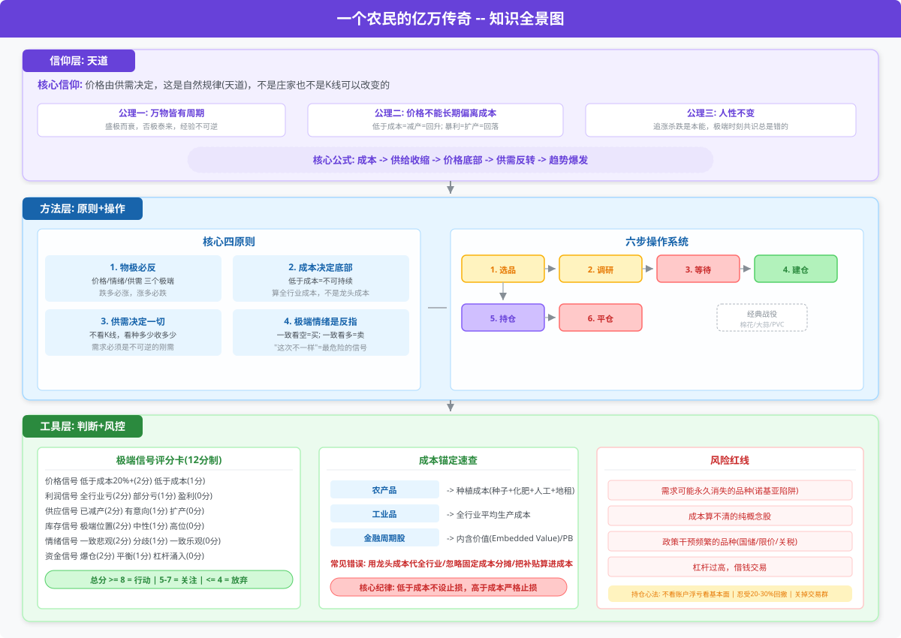
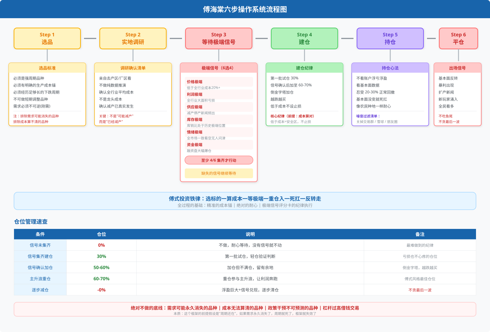

# 《一个农民的亿万传奇》—— 傅海棠投资体系全景拆解

> **适合读者**：周期投资者、商品期货交易者、想理解"成本锚定"思维的价值投资者  
> **不适合**：纯短线/技术分析者、只做成长股的人、不接受"重仓等待数月"风格的人

---

## 知识全景图



> **全景图使用说明**：全书的三个层级从上到下——信仰层（世界观的根）、方法层（具体怎么操作）、工具层（用什么工具判断）。阅读时先理解信仰层，再进入方法层拆解，最后用工具层做实战落地。

---

## 一、信仰层：天道投资哲学

### 1.1 什么是"天道"

傅海棠的核心世界观：**价格由供需决定，这是自然规律，和人为操纵无关**。他出身山东农民，没学过经济学，但种地、养猪、倒腾大蒜的经历给了他一套直觉式的"成本—供需"判断模型。

| 维度 | 主流市场的认知 | 傅海棠的认知 |
|------|---------------|------------|
| 价格由谁决定 | 庄家、资金、K线形态 | 供需关系，自然规律 |
| 市场是否可以预测 | 有不确定性，概率游戏 | 确定性机会存在，只是不常出现 |
| 交易是科学还是艺术 | 艺术成分大 | 科学成分大（成本锚是确定的） |
| 错误源于 | 技术不好、心态不稳 | 违背了天道规律 |

**核心信念**：市场不是赌场，**自然规律（天道）在市场中的表现形式就是供需法则**。当供需严重失衡时，价格一定会回归——这不是预测，是必然。

### 1.2 三条公理

傅海棠的天道体系建立在三条不可动摇的公理之上：

**公理一：万物皆有周期**
- 盛极而衰、否极泰来，这是自然规律
- 农产品：丰年→歉年 循环；工业品：扩产→减产 循环
- 人的情绪也在周期中：贪婪→恐惧→贪婪

**公理二：价格不可能长期偏离成本**
- 低于成本 → 亏钱 → 减产 → 供应减少 → 价格回升（必然）
- 高于成本暴利 → 赚钱 → 扩产 → 供应增加 → 价格回落（必然）
- 这是经济规律，和任何人的意志无关

**公理三：人性不变**
- 追涨杀跌是本能，不会因为有人读过书就改变
- 极端时刻，共识总是错的（一致性预期是反指）
- 最值钱的东西出现在没人想要的时候

---

## 二、方法层：核心四原则

### 原则一：物极必反

> "跌得多了就要涨，涨得多了就要跌——这是天道，不是技术分析。"

傅海棠的"物极必反"是三层次可量化的框架：

**① 价格极端**
- 价格低于全行业平均成本20%+ = 极端买入信号
- 价格高于成本100%+（暴利水平）= 极端卖出信号
- 底层逻辑：低于成本→生产者亏钱→必然减产→供应收缩→价格回升

**② 情绪极端**
- 全市场一致看空，没人敢碰 → 最安全的买入时机
- 全市场一致看多，"这次不一样" → 最危险的卖出时机
- 傅海棠原话："大多数人看好的时候，我就不做了；大多数人绝望的时候，我就进去了。"

**③ 供需极端**
- 供应端：减产、停产、破产新闻频出，种植面积/产能连续几年下降
- 需求端：需求只是被压抑（不是消失），一旦价格合适就会恢复
- **关键判断**：需求是否**不可逆**——棉花要穿衣、粮食要吃饭、水泥要盖房，这些是刚需

> **实操清单：判断"极端"四问**
> 1. 价格是否低于全行业平均生产成本20%以上？
> 2. 全行业是否大面积亏损，连龙头都在亏？
> 3. 融资盘是否大面积爆仓？市场情绪是否彻底绝望？
> 4. 供应端是否已经出现切实的减产/停产/退出？

### 原则二：成本决定底部

这是全书最硬核的框架。**价格可以低于成本，但不能长期低于成本**——这是经济规律。

**成本底的推导链条：**

```
价格 < 成本 → 生产者亏损 → 资金链断裂 → 减产/停产 → 供应减少 → 供不应求 → 价格回升
            ↑                                                                       │
            └───────────────────────── 必然发生 ────────────────────────────────────┘
```

**不同标的的成本锚：**

| 标的类型 | 成本锚 | 极端信号 | 供应弹性 |
|---------|-------|---------|---------|
| **农产品**（棉、蒜、豆） | 种植成本（种子+化肥+人工+地租） | 低于种植成本20%+，农民改种 | 最小（一年一度种植周期） |
| **工业品**（钢铁、水泥、化工） | 全行业平均生产成本 | 全行业亏损，高成本产线停产 | 中（关停成本高，底部时间长） |
| **金融周期股**（保险、券商） | 内含价值(Embedded Value) / 净资产 | PB < 0.5-0.6 | 大（无实物成本，靠利润弹性） |

**⚠️ 成本计算的三大常见错误（傅海棠反复强调）：**
- ❌ **用龙头成本代替全行业成本**——龙头成本最低，参考意义有限。要看全行业平均成本，算大多数企业的盈亏线
- ❌ **忽略固定成本分摊变化**——产量下降→固定成本分摊变厚→完全成本实际上升，利润恶化更快
- ❌ **把政策补贴算进成本**——补贴可能取消，回归真实成本后会更痛苦

### 原则三：供需决定一切

> "我做期货不看K线，我看的是这个：种了多少？收了多少？用了多少？还剩多少？"

**供应端分析：**
- 当前产量/产能利用率（是否在满产？是否在减产？）
- 新增产能周期（多久能投产？时间长=供应弹性小=爆发力强）
- 库存水平（显性+隐性库存，库销比在历史什么分位？）

**需求端分析：**
- 下游开工率（真正在用还是囤着？）
- 终端消费趋势（增长/持平/下降，幅度多大？）
- **核心判断**：需求是被压抑还是永久消失？（后者放弃）

**傅式供需框架的特有做法：**
- 不依赖宏观报告，而是**做实体调研**——去产区、去港口、去工厂、去批发市场
- 把模糊的"供需"变成可量化的几个数字：产量、库存量、消费量、进口量
- 关注边际变化：市场往往过度关注总量，忽略了变化的方向和速度

### 原则四：极端情绪是反向指标

> "行情在绝望中诞生，在犹豫中成长，在狂欢中结束。"

| 情绪阶段 | 市场状态 | 傅式操作 |
|---------|---------|---------|
| **绝望期** | 所有人看空，无人问津 | ✅ 建仓买入 |
| **怀疑期** | 价格小幅回升但没人信 | 持仓等待 |
| **确认期** | 趋势明朗，越来越多的人加入 | 持仓不动 |
| **狂欢期** | 所有人都看多，媒体唱多 | ✅ 逐步平仓 |
| **崩溃期** | 价格大跌，恐慌蔓延 | 已平仓，等待下一个周期 |

**量化判断标准**：
- 极端看空：行业展会没人去、分析师全是卖出评级、相关论坛只剩骂声、身边没人谈这个品种
- 极端看多：人人都在讨论、媒体密集报道、新手跑步入场、"永远涨"的说法出现

---

## 三、经典战役复盘

### 战役一：2010年棉花（奠定亿万身价的一战）

| 维度 | 详情 |
|------|------|
| **时间** | 2009年酝酿 → 2010年爆发 |
| **入场** | 1.6万元/吨（低于种植成本约2万元/吨） |
| **出场** | 3.4万元/吨 |
| **盈利倍率** | 约20倍（5万 → 100万 → 600万 → 1.2亿） |
| **持仓周期** | 约1年 |

**极端信号检核（全对）：**
- ✅ 价格极端：棉花价格多年低迷，低于种植成本30%+
- ✅ 利润极端：棉农大面积亏损，种植面积连续3年下降
- ✅ 供应极端：全球棉花产量降至历史低位
- ✅ 情绪极端：没人在乎棉花，分析师全在说"结构性过剩"
- ✅ 库存极端：库存/消费比处于数十年低位
- ✅ 需求极端：纺织需求正在复苏（中国+全球），但被低估

**操作复盘：**
- 2009年就开始关注，但等到极端信号集齐才入场
- 中间经历大幅回撤（浮亏几十万→扛住），靠成本锚支撑信念
- 3万以上开始逐步减仓，3.4万全部清仓
- **傅海棠的自我批评**：平仓偏早，3万以上减仓太快，少赚了一大截

### 战役二：2015年大蒜

| 维度 | 详情 |
|------|------|
| **背景** | 蒜价连续两年低迷，蒜农严重亏损 |
| **入场** | 4-5毛/斤（种植成本约0.8元/斤） |
| **出场** | 2元+/斤 |
| **盈利倍率** | 约3-4倍 |
| **持仓周期** | 数月 |

**极端信号检核：**
- ✅ 价格低于成本50%+ → 极端
- ✅ 种植面积大幅缩减
- ✅ 蒜农大面积改种其他作物
- ✅ 库存消化充分
- ⚠️ 需求相对稳定（大蒜是调味刚需）

**与棉花的异同：**
- 相同：极端价格低于成本+供应收缩+不可逆需求
- 不同：大蒜体量小、地域性强、价格弹性大（容易暴涨暴跌）

### 其他成功案例（简短）

| 品种 | 年份 | 核心逻辑 | 结果 |
|------|------|---------|------|
| 豆粕 | 2016 | 南美减产+需求复苏 | 大幅盈利 |
| PVC | 2016 | 供给侧改革+成本支撑 | 大幅盈利 |
| 螺纹钢 | 2016 | 去产能+需求超预期 | 大幅盈利 |

---

## 四、六步操作系统（标准化流程）



### 仓位管理规则

| 条件 | 仓位 | 说明 |
|------|------|------|
| 极端信号未集齐 | 0% | 不做，耐心等待 |
| 极端信号集齐，开始建仓 | 30% | 第一批试仓 |
| 信号确认+价格还在极端区间 | 50-60% | 加仓但不满仓 |
| 价格回升+基本面验证 | 60-70% | 重仓参与主升浪 |
| 浮盈巨大+信号充分兑现 | →0% 逐步减仓 | 不贪最后一波 |

**绝对不做的底线：**
- 需求可能永久消失的品种（如功能手机替代前的诺基亚）
- 成本无法算清的品种（纯概念、无成本锚）
- 政策干预不可预测的品种（频繁国储抛售、限价）
- 杠杆过高（傅海棠原则：自有资金为主，不借钱炒）

---

## 五、实战工具箱

### 工具1：极端信号评分卡

每次评估标的时的标准化检查表：

```python
评估标的：_________
评估日期：_________
当前价格：_________  全行业成本：_________

# === 评分项（每项0-2分）====

# 价格信号
□ 价格低于全行业平均成本20%+     → 2分
□ 价格低于成本但不到20%          → 1分
□ 价格在成本附近或以上           → 0分

# 利润信号
□ 全行业大面积亏损，龙头也在亏     → 2分
□ 部分亏损，龙头勉强盈利          → 1分
□ 全行业盈利                     → 0分

# 供应信号
□ 切实的减产/停产/退出已经发生     → 2分
□ 有减产意向但未落地              → 1分
□ 产能还在扩张                    → 0分

# 库存信号
□ 库存处于历史极端位置            → 2分
□ 库存中性                       → 1分
□ 库存仍在累积/还在高位            → 0分

# 情绪信号
□ 全市场一致悲观/无人关注          → 2分
□ 分歧较大                        → 1分
□ 全市场一致乐观                   → 0分

# 资金信号
□ 融资盘爆仓/多头大面积亏损        → 2分
□ 多空平衡                        → 1分
□ 杠杆资金涌入/空头被逼            → 0分

# === 总分 = _____/12 ===
≥ 8分  → 强烈行动信号 ✅
5-7分  → 重点关注，进一步调研 🔍
≤ 4分  → 放弃，等待更好的机会 ⏳
```

### 工具2：供需核验清单

**供应端：**
- [ ] 过去3年供应量变化趋势（增/减/持平？幅度？）
- [ ] 当前有哪些明确减产动作？（具体到产能数、时间表）
- [ ] 减产是市场行为还是行政命令？（行政减产持续性差）
- [ ] 新增产能需要多久？（时间越长→爆发力越强）
- [ ] 进口替代情况如何？（对外依存度高=国内减产效果更显著）

**需求端：**
- [ ] 下游开工率/消费量在什么水平？
- [ ] 终端需求过去1-3年趋势方向
- [ ] 需求是被压抑还是永久消失？（核心判断）
- [ ] 替代品是否在侵蚀需求？

**库存端：**
- [ ] 显性库存（交易所/港口/官方数据）
- [ ] 隐性库存（贸易商库存、社会库存）
- [ ] 库销比在历史什么分位？（最关键的指标之一）
- [ ] 库存集中度（在大户手里还是分散？集中=容易控盘）

### 工具3：持仓期间的心理管理

傅海棠模式最难受的不是等待入场的时机，而是**持仓过程中的大幅回撤**。

| 痛苦来源 | 傅式应对 | 你的应对工具 |
|---------|---------|------------|
| 浮亏很大，想割肉 | 看成本锚：低于成本就是安全区 | 提前算好成本线，贴电脑上 |
| 横盘很久，没耐心 | 看供需变化是否在按预期走 | 设置月度供需检核点 |
| 别人都赚你亏 | 反向指标：他们赚的是趋势钱 | 关掉交易群、雪球、朋友圈 |
| 媒体全是坏消息 | 媒体总是锦上添花和落井下石 | 你手里的供需数据比媒体客观 |
| 怀疑自己 | 重新检视：当初的极端信号还在吗 | 把评分卡重新打一遍 |

---

## 六、⚠️ 风险与红线

### 傅式方法的致命弱点

| 风险点 | 具体表现 | 防护措施 |
|-------|---------|---------|
| **成本算错** | 低估真实成本=抄底在半山腰 | 多方交叉验证：年报、行业网站、实地 |
| **需求永久消失** | 以为会恢复，实际不会（诺基亚/柯达） | 确认标的的"不可替代性" |
| **资金压力** | 浮亏巨大时被追保、被迫平仓 | 满仓是大忌；只用自有资金 |
| **时间成本** | 底部可能持续数年（如钢铁2011-2015） | 同时跟踪5-10个标的，哪个先信号集齐做哪个 |
| **政策风险** | 国储抛售、限价令、关税突变 | 避开政策干预频繁的品种 |
| **方向对但操作烂** | 仓位太轻、平仓太早、回撤时被洗出去 | 严格遵守六步流程，不做弹性变通 |

### 傅海棠自己犯过的错（书中坦承）

1. **过早平仓**（棉花）：3万以上就开始减仓，少赚了一大截
   - 教训：基本面没变就继续持有，不要提前下车
2. **过于自信**：有时会高估判断的确定性，忽视不利信号
   - 教训：持续检视基本面，不要一劳永逸
3. **逆势死扛不是万能**：只有低于成本时才该死扛，成本以上还是要严格止损
   - 教训：区分"低于成本的安全"和"高于成本的赌博"

---

## 七、与主流投资体系的对比

| 维度 | 傅海棠 | 价值投资（巴菲特） | 技术分析 |
|------|--------|------------------|---------|
| **核心锚** | 生产成本（商品层面） | 内在价值（企业层面） | 价格走势（K线层面） |
| **买入信号** | 价格低于成本+极端供需 | 价格低于内在价值 | 技术形态突破/金叉 |
| **持仓逻辑** | 供需变化驱动 | 企业盈利增长驱动 | 趋势延续驱动 |
| **卖出信号** | 供需反转/暴利出现/扩产 | 价格超过内在价值/基本面恶化 | 趋势反转信号 |
| **仓位风格** | 重仓集中（60-70%单一品种） | 适度集中（前10大持仓） | 分散或全仓 |
| **研究方法** | 实地调研+供需数据 | 财报分析+护城河评估 | 图表+指标 |
| **适合品种** | 强周期商品/周期股 | 优质企业股权 | 所有品种 |
| **最大优势** | 成本锚极清晰，有"底"可算 | 复利+优秀企业长期增长 | 灵活性高，覆盖广 |
| **最大劣势** | 适用范围窄（仅限于周期品） | 估值判断有主观性 | 无成本锚，容易失控 |

傅式方法与价值投资的关键区别：巴菲特找"好企业"，傅海棠找"坏到不能再坏的行业"——前者买优秀，后者买绝望中的必然反转。

---

## 八、快速上手路线图

如果读了这本书后想实践傅式方法，建议按这个顺序来：

```
第1周：建立数据感知
  ├─ 跟踪5个主要品种（螺纹、棉花、白糖、铜、豆粕）
  ├─ 找到每个品种的官方数据来源（交易所/行业协会网站）
  └─ 建立价格跟踪表格（每日记录）

第2周：算清成本
  ├─ 为每个品种找到全行业平均生产成本
  ├─ 记录过去5年价格运行区间
  └─ 标出"低于成本区间"和"暴利区间"

第3-4周：练习判断
  ├─ 选一个品种，用极端信号评分卡打分
  ├─ 写出完整的供需分析报告
  └─ 得出结论：可做/不可做/观望

第5周起：模拟交易
  ├─ 不真金白银入场，先纸上记录判断和拟操作
  ├─ 每周复盘：判断对了还是错了？为什么？
  └─ 连续判断正确+信号集齐再考虑实盘
```

---

> **一句话总结**：傅海棠把期货交易变成了一种"种地逻辑"——在所有人绝望的时候，以低于成本的价格播下种子，然后像老农一样看天看地、耐心等待，直到供需矛盾爆发带来收获。这套方法没有秘密，难的是在价格跌到成本以下时你敢不敢买，在浮亏几百万时扛不扛得住。

---

**参考来源**：
- 《一个农民的亿万传奇》—— 傅海棠自传
- 《傅海棠讲期货》—— 后续访谈集
- 雪月霜雪球实战验证框架（`fu-haitang-framework` skill）
