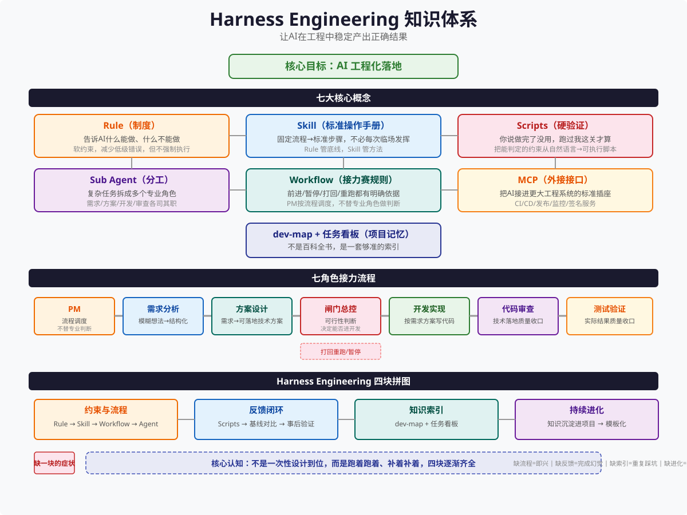
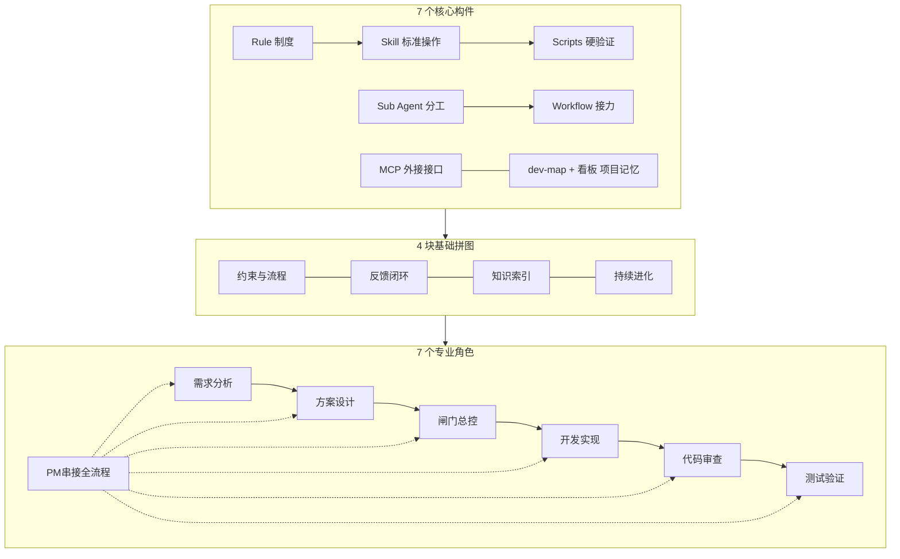
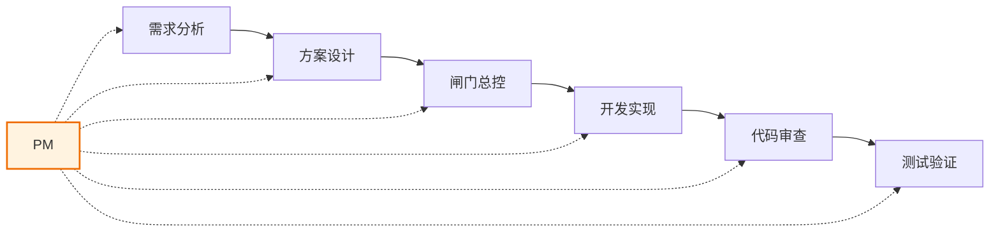

# Harness Engineering — AI 工程化落地读书笔记



> **一句话定义**：Harness Engineering 是一套让 AI 在工程环境中**稳定产出正确结果**的工程系统。不是提示词技巧，不是模型微调，是制度化地管住 AI 的执行质量。
>
> **实战案例**：JK Launcher（Unity 桌面启动器工具）全链路落地。

---

## 一、全景框架

Harness Engineering 由 **7 个核心构件 + 4 块基础拼图 + 7 个专业角色** 构成，三者咬合运转。



下面逐层拆解。

---

## 二、7 大核心构件

### 2.1 Rule — 制度

**Rule 告诉 AI 什么能做、什么不能做。软约束，不是硬门禁。**

- Rule 是自然语言写的行为准则，AI 会"记住"但也会"忘记"
- AI 会主动绕过 Rule——常见的借口："这次情况特殊""这不属于我的问题""我只是按要求做 X"
- Rule 有用的场景：原则性约束（"不能修改用户可见的字符串""不能删注释"）
- Rule 无用的场景：需要精确执行的流程（"编译前必须还原 NuGet 包"——AI 可能跳过）

**Rule 的边界**：Rule 管"**必须做/不能做**"的原则，不管"**具体怎么做**"的步骤。

---

### 2.2 Skill — 标准操作手册

**Skill 是把高频、固定、易错的流程固化成可复用的标准操作步骤。**

为什么需要 Skill？举编译为例——编译不是简单敲一条命令的事情：

- MSBuild 路径在哪里
- 需要哪些固定配置参数
- 编译前要不要还原 NuGet
- 日志怎么输出、怎么分析
- 错误怎么归类

**Rule vs Skill 的分工**：

| 维度 | Rule | Skill |
|------|------|-------|
| 管什么 | 原则约束 | 流程步骤 |
| 形态 | 自然语言规则 | 结构化操作手册 |
| 执行方式 | AI 自主判断是否遵守 | AI 按步骤执行 |
| 绕过难度 | 容易（AI 会找理由） | 难（步骤可验证） |
| 典型场景 | "不能硬编码 UI 文本" | "编译的完整操作流程" |

---

### 2.3 Scripts — 硬验证

**把自然语言约束变成可执行的验证脚本。AI 无法"觉得没问题"就绕过。**

Scripts 是 Harness 中最可靠的防线。总门禁脚本覆盖三大类：

#### 静态规范检查
| 检查项 | 说明 |
|--------|------|
| XAML 中文 / Emoji 检测 | 防止 UI 中出现未经本地化的中文 |
| 语法版本合规 | 目标框架版本是否符合项目规范 |
| MessageBox.Show 检测 | 不允许直接弹窗调试代码 |
| 硬编码 UI 文本检测 | 字符串必须走本地化资源文件 |
| 日志格式规范 | 统一日志输出格式 |
| 文件长度限制 | 单个文件不超过设定行数 |
| 本地化合规 | 资源文件是否完整覆盖 |

#### 基础交付检查
| 检查项 | 说明 |
|--------|------|
| 编译通过 | 代码能否成功构建 |
| 测试全过 | 所有单元测试通过 |
| 测试数正常 | 测试数量没有因为"误删"而减少 |

#### 工程一致性检查
| 检查项 | 说明 |
|--------|------|
| 规则同步 | 实际行为与 Rule 定义是否一致 |
| csproj 完整性 | 项目文件是否包含必要的引用和配置 |

**关键认知**：成熟 Harness 最后一定会越来越依赖脚本，而不是越来越依赖提示词。能写脚本判断的，绝不留给 AI 用"我觉得没问题"来决策。

---

### 2.4 Sub Agent — 分工

**单个 Agent 无法同时做好需求理解、方案设计、风险判断、编码、自审、测试。必须拆成专业角色。**

为什么一个人干不了所有事：
- 需求理解需要全局视野
- 编码需要关注细节实现
- 自审存在"自己写的代码看不出问题"的天然盲区
- 测试需要独立的破坏性思维

拆分成专业角色后，每个 Agent 只聚焦一件事，质量显著提升。

---

### 2.5 Workflow — 接力赛规则

**Workflow 不是"有几个人在干活"，而是"有一套稳定可复用的协作方式"。**

#### 三层结构

| 层级 | 写给谁看 | 内容 |
|------|----------|------|
| 第一层 | 人（研发链路全景） | 整体流程图、阶段划分 |
| 第二层 | 系统（阶段边界） | 每阶段的输入/输出/触发条件 |
| 第三层 | 角色（交接文档） | 当前棒次需要处理的具体材料 |

#### 上下文纪律（最重要的原则）

> **每棒只看当前需要的材料。**

- 开发 Agent 不需要看原始需求文档，只需要看方案设计
- 审查 Agent 不需要看方案设计阶段的过程讨论，只需要看最终方案和代码
- 测试 Agent 不需要看代码实现细节，只需要看功能规格和交付物

上下文越多，AI 越容易"挑着用"——只看到对自己有利的信息，忽略约束条件。

---

### 2.6 MCP — 外接接口

**MCP（Model Context Protocol）是把 AI 接进更大工程系统的标准插座。**

日常对接的工程系统：
| 系统 | 对接内容 |
|------|----------|
| CI 构建 | 自动触发构建流水线 |
| 日志读取 | 获取构建/运行日志 |
| 签名服务 | 代码签名、包签名 |
| 制品上传 | 构建产物上传到制品库 |
| 灰度提审 | 提审到应用商店/分发平台 |
| 状态回写 | 将结果状态写回任务系统 |

MCP 让 AI 不再是"只能聊天的窗口"，而是能操作真实工程设施的自动化节点。

---

### 2.7 dev-map + 任务看板 — 项目记忆

**不是百科全书，是一套够准的索引。**

| 组件 | 内容 | 维护者 |
|------|------|--------|
| dev-map | 代码模块结构、关键文件位置、模块依赖关系 | 开发 Agent |
| 任务看板 | 需求历史、任务状态、决策记录、遗留问题 | PM Agent |

#### 两条铁律
1. **dev-map 必须随代码变化同步更新**——如果地图与实际结构脱节，它比没有更危险（会误导）
2. **任务看板只记录"够用"的信息**——不需要事无巨细，但要能回答"这个需求为什么这么做""之前踩过什么坑"

**知识要沉淀进项目，不是沉淀进人的脑子里。**

---

## 三、7 个专业角色 & 协作逻辑

### 3.1 角色递进链



每个角色回答一个核心问题：

| 角色 | 核心问题 | 模型配置建议 |
|------|----------|-------------|
| 需求分析 | "想做什么" | 强模型 |
| 方案设计 | "打算怎么做" | 强模型 |
| 闸门总控 | "现在能不能做" | 强模型 |
| 开发实现 | "真正做出来" | 强模型 |
| 代码审查 | "是不是按要求做" | 强模型 |
| 测试验证 | "做出来能不能用" | 强模型 |
| PM | "整条链怎么串" | 简单/便宜模型即可 |

### 3.2 PM 的职责边界

**PM 只负责流程路由，不替任何专业角色做判断。**

- PM 的角色：发起任务、传递材料、检查阻塞、决定打回或放行
- PM 的禁区：不替需求分析写需求、不替方案设计出方案、不替审查判断代码质量
- 如果下游角色发现上游文档有问题 → 下游只能提阻塞项 → PM 决定是否打回上游修改

**下游不能私自修改上游文档。**

### 3.3 配不同档位模型的策略

不是所有岗位配同一把最贵的锤子：

- **PM**：用简单便宜的模型就够了——它只做路由和判断阻塞，不需要深度推理
- **需求分析 / 方案设计 / 审查 / 测试**：用更强的模型——这些角色需要深层理解能力和批判性思维
- **开发实现**：看情况——如果代码生成量大，也用强模型；如果只是执行已知修改，中等模型也可

---

## 四、落地演进路径（撞墙补洞）

Harness 不是一次性设计到位，而是跑着跑着、补着补着逐渐齐全。以下是真实踩过的坑和补上的方案：

| 轮次 | 撞到的墙 | 补上的方案 |
|------|----------|-----------|
| 第一轮 | 下游私自修改上游文档，导致需求失真、方案失准 | 补 Rule：下游只能提阻塞项，由 PM 打回上游修改 |
| 第二轮 | PM 越界给专业建议，比如 PM 替开发决定用什么技术方案 | 补 Rule：PM 只路由不判断，不参与专业决策 |
| 第三轮 | Agent 专业能力不足，审查发现不了深层问题，测试漏掉边界情况 | 补深度：审查和测试角色要站在收口位置，用更强的模型 |
| 第四轮 | Rule 不够用，AI 嘴上答应"好的"但实际绕过去了 | 补 Scripts：能判定的约束全部落地成可执行脚本 |
| 第五轮 | AI 偷懒说"这个 bug 不是我引入的""这段代码之前就是这样" | 补基线对比：改前改后各跑一次检查，对比差异 |
| 第六轮 | 流程本身难以维护，改了流程后不知道哪里没同步 | 补三层资产：流程定义文件 + 角色契约文档 + 流程校验脚本 |

**落地口诀**：先跑通一个最小闭环 → 观察 AI 在哪里出问题 → 针对性地加 Rule → Rule 不管用就加 Script → 角色不够专就拆 Sub Agent → 流程混乱就加固 Workflow。

---

## 五、4 块基础拼图

Harness 能稳定运转需要四块拼图全部到位。缺一块的症状如下：

| 缺哪块 | 症状 | 后果 |
|--------|------|------|
| 只有流程，没有反馈 | **完成幻觉** | 看起来很忙，每步都在推进，但不知道做对了没有。代码写完了但编译不过，无人检查 |
| 只有反馈，没有流程 | **闸机有空，上游即兴** | 脚本门禁跑得严，但需求是一句话需求，方案设计凭感觉，钱花在检测上但源头没管住 |
| 没有知识库 | **失忆循环** | 同类功能反复重写，同类坑反复踩。每次都要从头理解项目结构 |
| 没有进化机制 | **熵增** | 脚本和规则没人收紧，dev-map 与实际结构脱节，Harness 越来越松，直到失效 |

**四块拼图缺一不可**，顺序不重要，但最终必须全有。

---

## 六、红线与误区

### 6.1 常见错误认知

| 错误认知 | 真相 |
|----------|------|
| "AI 是助手，我指挥它干活" | AI 不是助手，是一支执行力极强但必须被制度化管理的团队 |
| "配最强的模型就够用了" | 模型再强也会绕 Rule、也会忘上下文，需要制度来兜底 |
| "Rule 写得够细就行了" | Rule 只能做原则约束，不能做流程执行。AI 会忘、会找理由绕过 |
| "一次设计好 Harness 就能一直用" | Harness 必须持续演进——踩一个坑补一块板 |
| "完成就是做好了" | 完成不等于正确，推进不等于收口，做了事情不等于把事情做好 |
| "人退到旁观就对了" | 人从执行者上移成了系统设计者和最后责任人——不是没事干了 |

### 6.2 最值钱的认知

> **真正贵的不是 token，真正贵的是失控。**

一个 AI 在错误的方向上跑了 10 万 token 产生的破坏，远高于正确的 100 万 token 的成本。所以 Harness 的第一优先级不是降 token 成本，而是**防失控**。

### 6.3 Rule 的两大死穴

1. **AI 会遗忘**——上下文窗口再大，Rule 堆到一定数量后 AI 就开始"选择性失忆"
2. **AI 会绕过**——当 Rule 和当前任务冲突时，AI 会给自己找台阶下（"这次特殊""这不是我的问题""我只是按要求做 X"）

对策：规则能脚本化的全部脚本化，不要让 AI 自己判断"是否遵守了 Rule"。

---

## 七、行动工具箱

### 7.1 从零搭建 Harness 的 10 步检查清单

```
□ 1. 定义第一个完整任务，跑通一次全链路
□ 2. 观察 AI 在哪一步出了什么问题（记下来）
□ 3. 针对问题写第一条 Rule
□ 4. 如果 Rule 无效（AI 再次犯同样错误），写脚本验证
□ 5. 划分角色——至少拆出"开发"和"审查"两个角色
□ 6. 定义 Workflow 的第一版——输入是什么、输出是什么、交接文档长什么样
□ 7. 建立 dev-map——最关键的文件路径和模块关系
□ 8. 建立任务看板——需求和决策记录
□ 9. 跑第二轮，观察新问题，循环迭代
□ 10. 定期复盘——脚本有没有漏掉的、规则需不需要收紧
```

### 7.2 门禁脚本必检清单（按优先级）

```
[P0] 编译是否通过
[P0] 测试是否全部通过
[P0] 测试数量是否正常变化
[P1] 硬编码 UI 文本检测
[P1] 禁止的关键 API 调用检测
[P1] 文件长度超标检测
[P2] 日志格式规范检测
[P2] 本地化资源完整性检测
[P2] 语法版本 / 目标框架合规检测
[P3] 代码风格统一性检测
```

### 7.3 Workflow 交接文档模板

```
## 任务 ID：[编号]
## 当前阶段：[需求分析 / 方案设计 / 开发 / 审查 / 测试]
## 输入材料：
   - [材料 1: 路径/说明]
   - [材料 2: 路径/说明]
## 输出产物：
   - [产物 1: 路径/说明]
## 约束条件：
   - [条件 1]
   - [条件 2]
## 阻塞项（由上游解决）：
   - [无 / 具体阻塞项]
```

### 7.4 常见问题的快速诊断

| 现象 | 大概率问题 | 先查什么 |
|------|-----------|---------|
| AI 反复犯同一个错 | Rule 没用，需要脚本化 | 写一条脚本验证 |
| 代码写完了但编译不过 | 缺少编译 Skill | 把编译流程写成 Skill |
| 审查发现不了深层问题 | 审查 Agent 模型不够强 | 升级审查角色的模型 |
| 每个任务都在重写相同功能 | dev-map 过期或缺失 | 更新 dev-map |
| 任务状态混乱、不知道卡在哪 | Workflow 交接不清晰 | 检查交接文档模板 |
| 需求每次都不一样 | SPEC 不够确定 | 去掉"建议/可选/推荐"等不确定词 |

### 7.5 SPEC 金标准

真正的第一步不是写 Rule，而是把完整的设计规格文档（SPEC）和 AI 反复磨透。

**SPEC 金标准**：全文没有以下词语——
- 建议
- 可以
- 推荐
- 可选
- 也许
- 看情况

每个"不确定词"都是给 AI 打开的一扇绕过程序的门。

---

## 八、关键认知总结

1. **"真正贵的不是 token，真正贵的是失控"** — Harness 第一优先级是防失控
2. **"Rule 只能做原则约束，不能做流程执行"** — 原则靠 Rule，执行靠 Skill + Script
3. **"完成不等于正确，推进不等于收口，做了事情不等于把事情做好"** — 每个阶段要有明确的"完成标准"
4. **"人从执行者上移成了系统设计者和最后责任人"** — 人不写代码了，但人要设计代码怎么被正确产生
5. **"AI 不是助手，是一支执行力极强但必须被制度化管理的团队"** — 态度对了，系统才能对
6. **"成熟 Harness 最后一定会越来越依赖脚本，而不是越来越依赖提示词"** — 确定性来自代码，不是来自文字
7. **"Harness 不是一次性设计到位，而是跑着跑着、补着补着逐渐齐全"** — 接受不完美的开始，在迭代中完善
8. **"知识要沉淀进项目，不沉淀进人"** — dev-map、看板、脚本、Rule 都是项目资产

---

## 九、后续演进方向

| 方向 | 说明 |
|------|------|
| Rule 持续脚本化 | 能写脚本判断的约束，全部从 Rule 迁移到 Scripts |
| 流程产品化 | 状态机管理、自动校验、可视化 Workflow |
| 项目类型模板 | 预置 WPF / Unity / 后端服务各自的最小可用 Harness |
| 知识闭环强化 | 每轮任务完成后自动更新 dev-map 和看板，形成记忆闭环 |
| 模型分层优化 | 不同角色配不同档位模型，性价比最优 |

---

> **最后一句**：Harness Engineering 不是关于怎么让 AI 更聪明，而是关于怎么让 AI 在犯错时能被发现、被纠正、被拦住。它是工程思维在 AI 时代的自然延伸。
