# Harness Engineering 读书笔记：QQ音乐在大仓多服务场景的AI协作工程落地

> **原文**：腾讯云开发者公众号 · QQ音乐（腾讯音乐）团队  
> **核心命题**：当 Vibe Coding 遇见 50+ 微服务的 Monorepo，如何让 AI Agent 不"乱跑"？

---

## 一、知识全景图（总览）

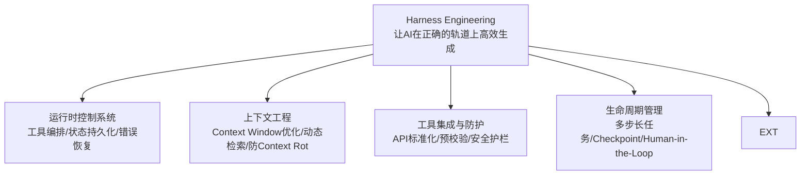

**一句话概括**：Harness Engineering 不是又一个 AI 编码工具，而是一套工程治理层——在 Claude Code、Cursor、Cline 等执行工具之上，定义 AI Agent 在多服务大仓中必须遵守的规则和上下文。

---

## 二、核心脉络：从 Vibe Coding 到 Harness Engineering

### 2.1 三代 AI 编码演进

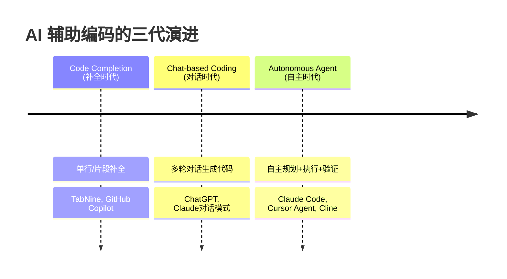

**关键判断**：第三代（Agent 时代）才是真正的转折点。前两代本质上是"更智能的补全和模板生成"，Agent 时代意味着 AI 能自主阅读仓库、写代码、运行测试、提交 PR。

### 2.2 Vibe Coding 的三个结构性缺陷

**定义**："Vibe Coding"指让 AI 自由生成代码，人类只需跟着"感觉"走，不深究具体实现。

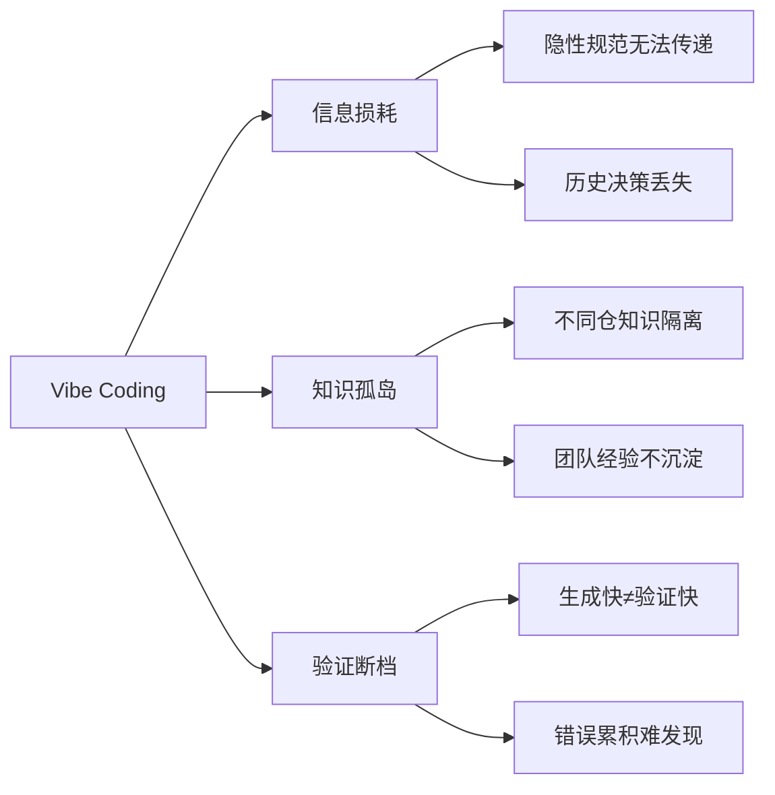

1. **信息损耗**：隐性编码规范、架构决策历史、业务上下文在传递过程中大量丢失。Agent 生成代码时看不到"为什么这么设计"。
2. **知识孤岛**：Monorepo 中不同服务的知识散落在各自仓库中，Agent 无法跨仓理解依赖关系和服务契约。
3. **验证断档**：生成速度远快于验证速度。AI 每秒产出数百行代码，但单元测试、集成测试、代码审查的速度跟不上，导致错误累积。

### 2.3 核心矛盾

> **生成速度快 ≠ 验证能力同步提升**

这是 Vibe Coding 最致命的悖论。代码产出越多，未经验证的代码堆积越多，最终"技术债务"会以指数级增长。

### 2.4 Harness Engineering 的回应

Harness Engineering 不反对 AI 生成，而是反对"无约束的生成"。核心思路：**先约束，再生成；先验证，再合并**。

---

## 三、核心公式：代码产出 = AI 能力 × 上下文质量

### 3.1 公式拆解

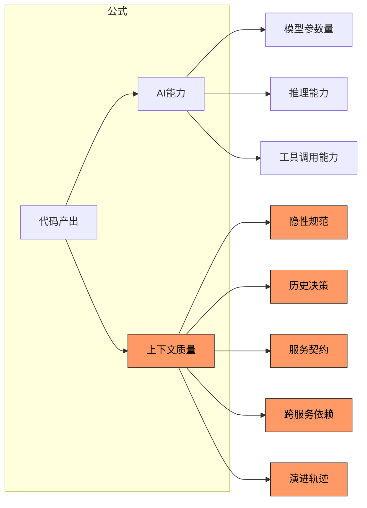

### 3.2 乘号的深刻含义

**关键洞察**：当上下文质量趋近于 0 时，无论 AI 能力多强（GPT-10 也不行），代码产出也是 0。

- 模型能力是别人的（依赖第三方 API）
- 上下文质量是自己的（完全可控）
- **杠杆点**：提升上下文质量比提升模型能力更高效、更可控

### 3.3 五类上下文缺口

| 缺口类型 | 含义 | 典型问题 |
|---------|------|---------|
| **隐性规范** | 团队未文档化的编码约定、命名风格、错误处理模式 | Agent 用驼峰命名，团队用下划线 |
| **历史决策** | 架构选型背后的 trade-off 和约束 | Agent 引入新依赖，不知为何当初被 ban |
| **服务契约** | IDL 接口定义、协议约束、版本兼容性 | Agent 修改了接口字段，下游服务崩溃 |
| **跨服务依赖** | 服务间调用链、数据流、部署顺序 | Agent 修改 A 服务，不知 B 和 C 依赖 A |
| **演进轨迹** | 代码从哪来、到哪去、为什么变更 | Agent 重构了一段"奇怪代码"，其实是性能优化的结果 |

---

## 四、什么是 Harness Engineering

### 4.1 语义溯源

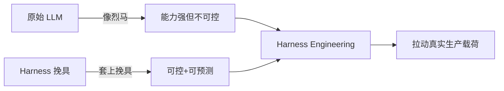

"Harness" 在英文中是马具/挽具。原始 LLM 像一匹烈马——能力强但方向不可控。Harness Engineering 就是给这匹烈马套上挽具，让它能拉动真实的生产载荷。

### 4.2 四大标准组件

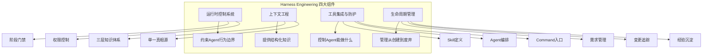

### 4.3 QQ音乐的扩展定义

QQ音乐团队在实践中将四大组件扩展为：

> **Team Agent Governance = Multi-Agent × Multi-Service × Multi-Lifecycle**

- **Multi-Agent**：多 Agent 协同（代码审查拆成 8 个维度的独立 Agent 并行执行）
- **Multi-Service**：跨 50+ 微服务的依赖管理
- **Multi-Lifecycle**：覆盖需求→设计→开发→交付全生命周期

---

## 五、业务场景与框架设计

### 5.1 背景：为什么需要自研？

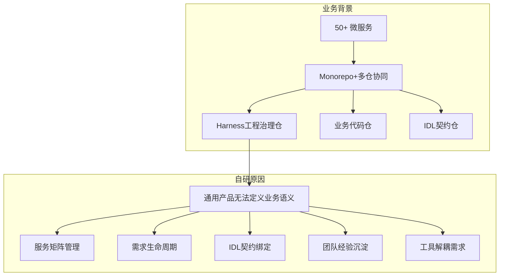

**核心原因**：市场上通用 AI 编码工具（Claude Code、Cursor 等）无法理解 QQ音乐内部的业务语义——服务矩阵怎么组织？需求生命周期怎么流转？IDL 契约怎么绑定？团队经验怎么沉淀？

### 5.2 四类约束（必须进入框架）

1. **流程约束**：需求必须经过评审→设计→开发→交付的流程门禁
2. **拓扑约束**：服务间依赖关系必须符合已定义的架构拓扑
3. **契约约束**：跨服务接口变更必须遵守 IDL 契约兼容性规则
4. **知识约束**：团队经验文档必须被 Agent 引用，不可忽视历史教训

### 5.3 L5 工程治理层定位

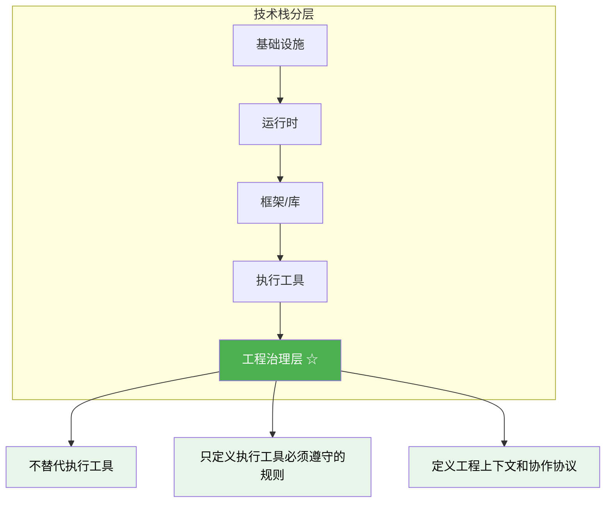

**定位三句话**：
- 不替代任何执行工具（Claude Code 照用、Cursor 照用）
- 只定义执行工具必须遵守的工程上下文和协作协议
- 规则存在仓库里，通过 `scripts/install.sh` 渲染到各工具配置中

### 5.4 工程制品清单（10 项）

| 编号 | 制品 | 说明 |
|-----|------|------|
| 1 | `AGENTS.md` | 顶层 AI 协作规范入口 |
| 2 | `.codebuddy/skills/` | 可复用工作流定义（34个） |
| 3 | `.codebuddy/agents/` | 自主子任务 Agent 定义（24个） |
| 4 | `.codebuddy/commands/` | 固定入口+标准化参数命令（35个） |
| 5 | `context/team/` | 团队级知识（团队规范、流程文档） |
| 6 | `context/harness-framework/` | 框架工程级知识（框架本身的设计文档） |
| 7 | `context/project/` | 服务级知识（每个服务的专属上下文） |
| 8 | `.service-matrix/dependencies.yaml` | 服务依赖矩阵单一真相源（57个服务） |
| 9 | `requirements/` | 需求定义文档 |
| 10 | `scripts/install.sh` | 配置渲染脚本（将.codebuddy/规则分发到各工具） |

---

## 六、五阶段 + 四门禁：流程框架

### 6.1 五阶段全景

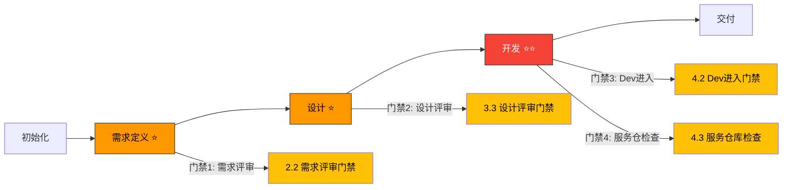

### 6.2 四个强制门禁详解

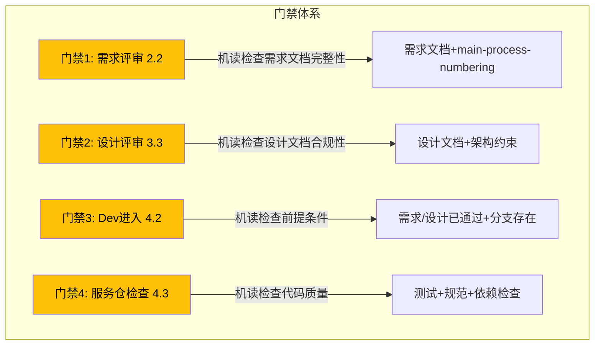

**四个门禁的共同特征**：

| 特征 | 说明 |
|------|------|
| **设在工作价最低的拐点上** | 在错误放大之前拦截，而非在修复时 |
| **机读的，不是口头的** | 由 Agent/Skill 自动检查，不需要人工会议 |
| **对应 markdown 规范** | 每个门禁的检查条件是明确写在 markdown 文件中的 |
| **单一真相源** | `main-process-numbering.md` 记录所有需求和阶段的唯一编号 |

### 6.3 为什么门禁是机读的

传统工程流程的痛点：评审靠人工、检查靠开会、状态靠记忆。

QQ音乐的解法：
- **门禁规范写进 markdown** → Agent 可以读取
- **检查交给 Skill** → 自动运行验证规则
- **状态记录进文件** → `main-process-numbering.md` 统一追踪

这使得整个流程对 Agent 友好——Agent 不需要"理解"流程，只需要"读取"规范文件并执行。

---

## 七、三层知识体系 + 三仓联动

### 7.1 三层知识体系

```mermaid
graph TB
    subgraph 三层知识
    L1[团队级 context/team/] --> L1a[INDEX.md 入口]
    L1 --> L1b[团队编码规范]
    L1 --> L1c[流程定义]
    L1 --> L1d[架构原则]
    end
    
    subgraph 
    L2[框架工程级 context/harness-framework/] --> L2a[INDEX.md 入口]
    L2 --> L2b[框架设计文档]
    L2 --> L2c[Skill/Agent/Command 目录]
    L2 --> L2d[占位符词典]
    end
    
    subgraph 
    L3[服务级 context/project/] --> L3a[INDEX.md 入口]
    L3 --> L3b[服务专属上下文]
    L3 --> L3c[API 文档]
    L3 --> L3d[部署信息]
    end
    
    L1 --> L2 --> L3
```

**每层结构**：
- 都有一个 `INDEX.md` 作为入口
- 检索成本 O(1)——Agent 只需要读 INDEX 就能找到需要的上下文在哪里
- 知识粒度和范围从大到小：团队级（全部）→ 框架级（框架本身）→ 服务级（单个服务）

### 7.2 .service-matrix/dependencies.yaml：单一真相源

这是整个 Harness Engineering 最关键的知识资产。管理着 57 个服务的依赖关系。

```yaml
# 简化示例（非原文）
services:
  playlist-service:
    dependencies:
      - user-service
      - music-metadata-service
    depends-on:
      - idl-protocols
    api-version: v2
    owners: ["team-a"]
  user-service:
    api-version: v1
    owners: ["team-b"]
    provides:
      - user-profile
      - auth
```

**为什么是单一真相源**：
- 避免 Agent 从不同地方获取矛盾的依赖信息
- 所有 Agent 共享同一个依赖图
- 修改依赖只需改一个文件

### 7.3 三仓联动

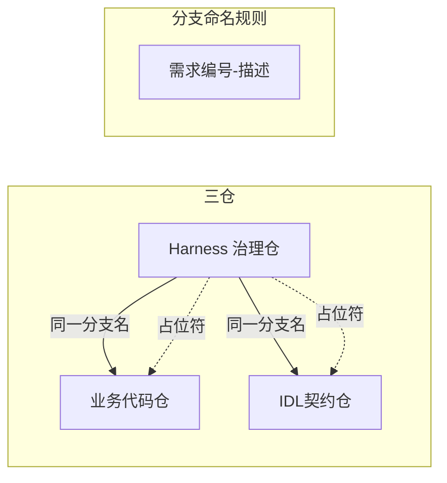

**三仓联动规则**：
1. 每个需求在三个仓库使用完全相同分支名
2. 全仓只允许使用 `{business-repo}` 等占位符（禁止硬编码仓库路径）
3. 占位符词典统一管理，写进框架文档中

**意义**：Agent 在任何一个仓库中都知道其他两个仓库的对应分支在哪，实现跨仓上下文关联。

---

## 八、Skill-Agent-Command 三件套

### 8.1 整体架构

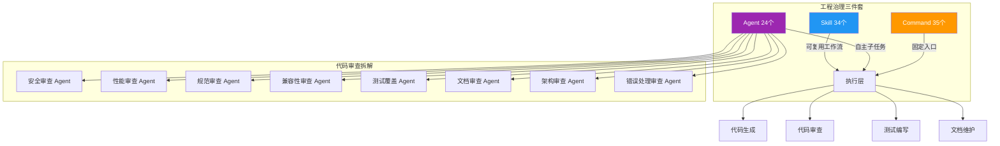

### 8.2 Skill（34 个）—— 可复用工作流

**定义**：一系列操作步骤的模板，Agent 可以调用 Skill 来执行标准化任务。

**典型 Skill 示例**：
- `skill_new_service.md`：创建新服务的完整工作流（包括生成模板、注册到服务矩阵、创建 CI 配置等）
- `skill_code_review.md`：代码审查标准流程
- `skill_deploy_check.md`：部署前检查清单

**Skill 的特点**：
- 可版本化（存放在 `.codebuddy/skills/`）
- 可组合（一个 Skill 可以调用另一个 Skill）
- 可被 Agent 自动选择（Agent 根据任务类型匹配合适的 Skill）

### 8.3 Agent（24 个）—— 自主子任务执行者

**定义**：有明确职责范围的自主 Agent，每个 Agent 聚焦于一个子领域。

**典型 Agent 列表**：

| Agent | 职责 |
|-------|------|
| `code-review-security-agent` | 安全漏洞检测 |
| `code-review-performance-agent` | 性能瓶颈分析 |
| `code-review-style-agent` | 编码规范检查 |
| `code-review-compatibility-agent` | 接口兼容性检查 |
| `code-review-test-coverage-agent` | 测试覆盖度评估 |
| `code-review-docs-agent` | 文档完整性检查 |
| `code-review-architecture-agent` | 架构合规性检查 |
| `code-review-error-handling-agent` | 错误处理模式检查 |

**关键实践：代码审查拆成 8 个独立 Agent**：
- 每个 Agent 只关注一个维度
- 并行执行，互不干扰
- 审查结果汇总到统一格式的报告中

### 8.4 Command（35 个）—— 固定入口

**定义**：Slash 命令形式的固定入口，标准化参数传递。

**典型 Command 示例**：
- `/new-service`：创建新服务
- `/add-dependency`：添加服务依赖
- `/req-review`：提需需求评审
- `/design-review`：提交设计评审
- `/start-dev`：进入开发阶段

**Command 的设计原则**：
- 减少 Agent 自主决策的负担（用户告诉 Agent 做什么，Agent 执行）
- 参数标准化（避免 Agent 自己猜测参数含义）
- 与门禁系统绑定（执行 Command 时自动触发门禁检查）

---

## 九、Self-Refinement：自进化闭环

### 9.1 闭环流程

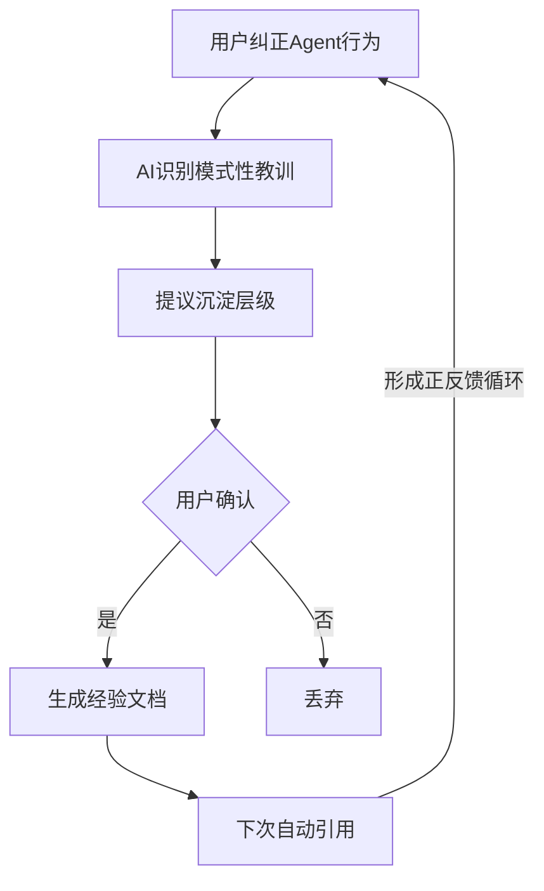

### 9.2 两种沉淀产物

| 产物 | 路径 | 用途 |
|------|------|------|
| **经验文档** | `experience/*.md` | 记录具体教训、踩过的坑 |
| **SOP** | `sop/*.md` | 记录标准化操作流程 |

**关键机制**：
- 不是简单的"记住了"，而是结构化的"教训→模式→文档→自动引用"
- AI 识别的是**模式性教训**（这个错误会再次发生），而非一次性问题
- 沉淀层级由 AI 提议、用户确认（不是 AI 自作主张）

### 9.3 框架自身的进化

**最精彩的部分**：Harness Engineering 框架本身就是 Self-Refinement 的活样本。这意味着：

1. 框架文档会随着使用不断优化
2. Agent 的行为会随着经验积累越来越准确
3. 团队的工程规范会自然演化（不依赖自上而下的推行）

---

## 十、与 Claude Code / Cursor / Cline 的关系

### 10.1 不是二选一，而是分层协作

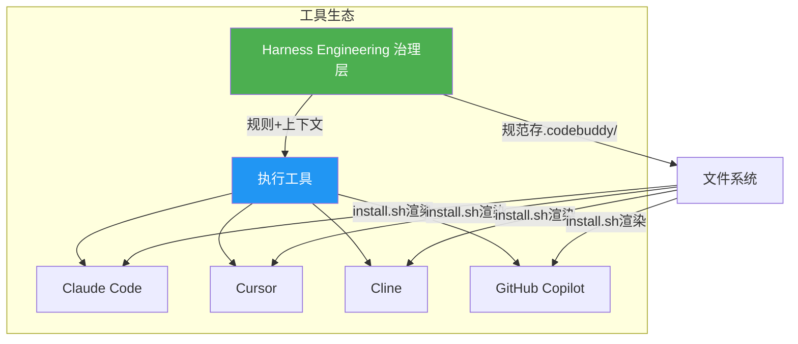

### 10.2 三句话总结关系

> **执行交给工具、规则留在仓库、协议连接两者**

1. **执行交给工具**：Claude Code、Cursor、Cline 各自发挥最擅长的代码生成能力
2. **规则留在仓库**：所有工程规范、上下文、流程定义都作为文件存在 `.codebuddy/` 中
3. **协议连接两者**：`scripts/install.sh` 将规则渲染到 `.claude/`、`.gemini/`、`.codex/`、`.continue/` 等工具配置中

### 10.3 为什么这样设计

- **工具在快速迭代**：今天用 Claude Code，明天可能换成更好的工具。如果规则绑定在工具里，迁移成本极高。
- **仓库是稳定的**：规则留在仓库中，工具可以换，规则不会丢。
- **协议是通用的**：`.codebuddy/` 目录规范是工具无关的，任何支持自定义配置的 AI 编码工具都能接入。

---

## 十一、行动工具箱（Action Toolkit）

### 11.1 如果你是技术 Leader——推动 Harness Engineering

| 步骤 | 行动项 | 产出 |
|------|--------|------|
| 1 | 盘点团队隐性知识（规范、决策、契约、依赖） | 上下文缺口清单 |
| 2 | 建立 `.service-matrix/dependencies.yaml` | 单一真相源 |
| 3 | 定义四类约束（流程/拓扑/契约/知识） | 约束清单 |
| 4 | 搭建三层知识目录（团队/框架/服务） | INDEX.md 体系 |
| 5 | 实现五阶段四门禁流程 | main-process-numbering.md |
| 6 | 编写第一批 Skill（3-5 个核心工作流） | .codebuddy/skills/ |
| 7 | 编写第一批 Agent（审查/测试等） | .codebuddy/agents/ |
| 8 | 实现 Self-Refinement 闭环 | experience/*.md |
| 9 | 编写 install.sh 渲染脚本 | 工具绑定 |
| 10 | 小范围试点 → 迭代 → 推广 | 团队共识 |

### 11.2 如果你是开发者——在 Harness 框架下工作

| 场景 | 操作 | 说明 |
|------|------|------|
| 开始新需求 | 阅读 AGENTS.md → 查看流程 → 运行对应 Command | 不走偏 |
| 提交代码 | 等待 8 个审查 Agent 并行检查 → 查看汇总报告 | 不被阻塞 |
| 遇到错误 | 纠正 Agent → 确认 Self-Refinement 建议 | 让团队受益 |
| 跨服务改动 | 检查 dependencies.yaml → 理解影响范围 | 不炸下游 |
| 查看上下文 | 从 INDEX.md 三级入口检索 | O(1) 效率 |

### 11.3 关键检查清单

启动 Harness Engineering 前问自己：

- [ ] 我们有超过 10 个微服务吗？（如果 <10，Harness 可能过度工程化）
- [ ] 我们是否经常遇到"AI 生成了正确但不符合规范的代码"？
- [ ] 团队隐性知识是否"只存在于老人的脑子里"？
- [ ] Agent 是否经常做出违反架构原则的决定？
- [ ] 跨服务修改是否经常导致意外故障？
- [ ] 是否有一个可维护的依赖关系图（不管用什么形式）？
- [ ] 团队是否愿意投入时间维护上下文文档？

> 如果以上多数答案为"是"，Harness Engineering 值得投入。

---

## 十二、红线误区（Red Flags & Pitfalls）

### ❌ 误区 1：Harness Engineering = 又一套流程文档

**现实**：它不是给人看的流程文档，而是**写给 Agent 读的可执行规范**。门禁是机读的，知识是结构化的，Skill 是可运行的。

**红线**：如果把 Harness Engineering 做成 PPT 和 Word 文档放在 Confluence 里，那就完全走错了方向。

### ❌ 误区 2：框架越全越好，一次把所有都建好

**现实**：QQ音乐团队做了 34 个 Skill、24 个 Agent、35 个 Command——但这经过了长时间的迭代。从 3-5 个核心 Skill 开始，让团队适应后再扩展。

**红线**：一次性铺开所有组件，团队成员会抗拒，Agent 行为会混乱，维护成本会爆炸。

### ❌ 误区 3：Harness Engineering = 替换现有工具

**现实**：Harness Engineering 是**治理层**，不是执行层。Claude Code 照用、Cursor 照用。它定义的是"这些工具在你们的 Monorepo 里该怎么表现"。

**红线**：禁止现有工具，强制所有人使用"统一入口"——这会扼杀开发者的工具选择自由。

### ❌ 误区 4：知识沉淀是 AI 的事，团队不用维护

**现实**：Self-Refinement 的前提是**用户纠正**。如果团队成员不在 Agent 犯错时纠正它，Self-Refinement 就是空转。

**红线**：买了一套"AI 工程治理方案"就躺着不动——知识需要持续喂养和维护。

### ❌ 误区 5：门禁越多越安全

**现实**：四个门禁都设在"工作价最低的拐点上"。门禁的数量不是越多越好，而是每个门禁都要有明确的 ROI——拦截成本 vs 修复成本。

**红线**：加了一堆无关紧要的门禁，导致开发流程冗长、Agent 频繁被打断，团队怨声载道。

### ❌ 误区 6：上下文写一次就够了

**现实**：服务在演进、依赖在变化、团队在成长。`.service-matrix/dependencies.yaml` 和三层知识需要持续更新。过时的上下文比没有上下文更可怕——它会引导 Agent 做出基于错误前提的决策。

**红线**：写完了就再也不维护，半年后上下文全部过时，Agent 产出质量反而下降。

### ❌ 误区 7：Self-Refinement 是自动的

**现实**：Self-Refinement 的完整闭环是"用户纠正 → AI 识别 → 用户确认 → 沉淀 → 下次引用"。用户确认这一步不可跳过。AI 提议层级可能不对，AI 总结的教训可能偏颇。

**红线**：让 AI 完全自主地修改框架文档——没有人类审核的 Self-Refinement 是自欺欺人。

### ❌ 误区 8：三仓联动太麻烦，不如单仓

**现实**：三仓联动的本质是**解耦**——治理逻辑、业务代码、接口契约三者变更频率和生命周期不同，强行放在一个仓里会互相干扰。

**红线**：为了"省事"把所有内容放在一个仓库，结果治理规范的 PR 阻塞业务代码的发布。

---

## 十三、核心洞察与延伸思考

### 13.1 为什么 Harness Engineering 是必然趋势

AI 编码工具的能力已经到了"能写能跑"的阶段，但距离"能写对能跑稳"还有很大差距。这个差距不来自模型能力，而来自**工程上下文的缺失**。

随着 Agent 自主性越来越强（从补全→对话→完全自主），对工程上下文的需求只会越来越大。Harness Engineering 给出的不是一个具体方案，而是一个范式：

> **让 Agent 读取工程上下文比让 Agent 记忆工程上下文更可靠**

### 13.2 从 Context Engineering 到 Knowledge as Code

文章最后提到的三句话值得反复品味：

> **Context Engineering + Spec-First + Knowledge as Code = 可验证、可演进的 AI 协作工程基线**

- **Context Engineering**：上下文不是自然存在的，是需要工程化设计的
- **Spec-First**：先定义规格，再生成代码（而非先写代码再补文档）
- **Knowledge as Code**：知识像代码一样版本化、审查、测试

### 13.3 对 AI 工程化的启示

QQ音乐的实践揭示了一个更深层的趋势：

```
传统的 DevOps = 人写代码 + CI/CD 自动化
AI-native DevOps = Agent 写代码 + Harness Engineering 治理 + CI/CD 自动化
```

在 AI-native 的工程体系中，"治理"取代"管理"成为核心范式——不是控制人，而是约束 AI Agent 的行为边界。

### 13.4 适用性判断

**适合 Harness Engineering 的场景**：
- 10+ 微服务或大仓（Monorepo）
- 有明确的架构规范和编码约定
- 团队对 AI 编码工具有较高依赖度
- 跨服务依赖复杂，经常出现"改了 A 炸了 B"
- 有专门的平台/工具团队

**不适合的场景**：
- 小型项目（1-3 个服务）
- 探索性项目（快速验证想法）
- 团队没有意愿维护上下文文档
- AI 编码工具使用频率很低

---

## 十四、总结

### 14.1 一句话版本

> **给 AI Agent 套上工程化的"挽具"，让它在 Monorepo 中不跑偏、不炸仓、能学习、能进化。**

### 14.2 五个核心要点

1. **核心公式**：代码产出 = AI 能力 × 上下文质量 —— 上下文质量是杠杆点
2. **治理 vs 执行**：Harness Engineering 是治理层，不替代 Claude Code/Cursor/Cline
3. **机读门禁**：四个门禁都在工作价最低的拐点，由 Agent 自动检查
4. **三层知识**：团队级→框架级→服务级，每层 INDEX.md 入口，检索 O(1)
5. **自进化**：Self-Refinement 让框架随着使用不断优化

### 14.3 原文金句摘录

> "执行交给工具、规则留在仓库、协议连接两者。"

> "不替代任何执行工具，只定义执行工具必须遵守的工程上下文和协作协议。"

> "代码产出 = AI 能力 × 上下文质量。当上下文质量趋近于 0，产出就是 0。"

> "提升上下文质量比提升模型能力更高效——因为前者在自己掌控中。"

> "每个门禁都设在工作价最低的拐点上——在错误放大之前拦截，而非在修复时。"

> "框架自身的演进就是 Self-Refinement 活样本。"

---

*笔记整理完成 · 原文约22K字 · 笔记约8.5K字*
